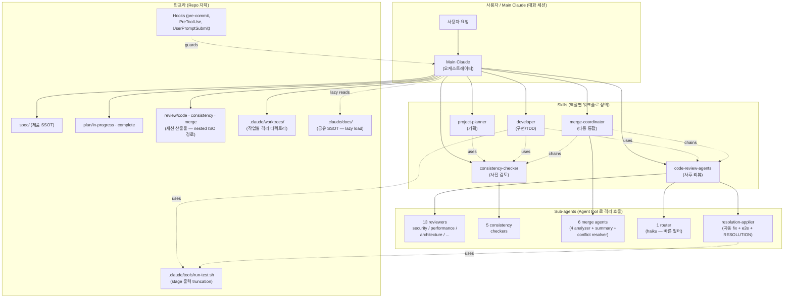
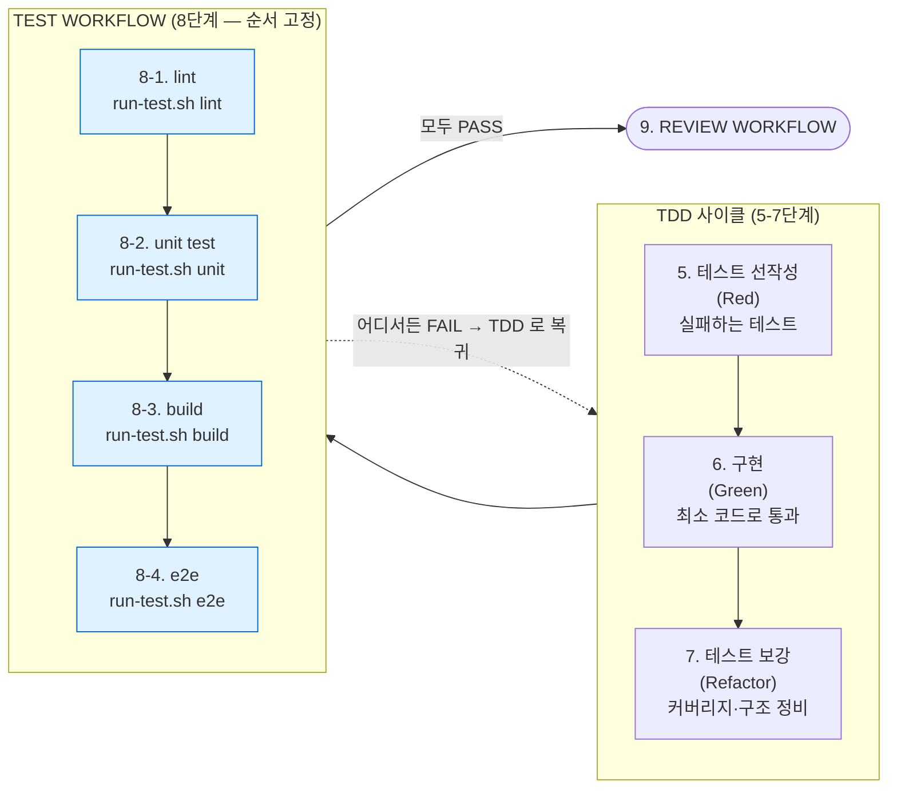
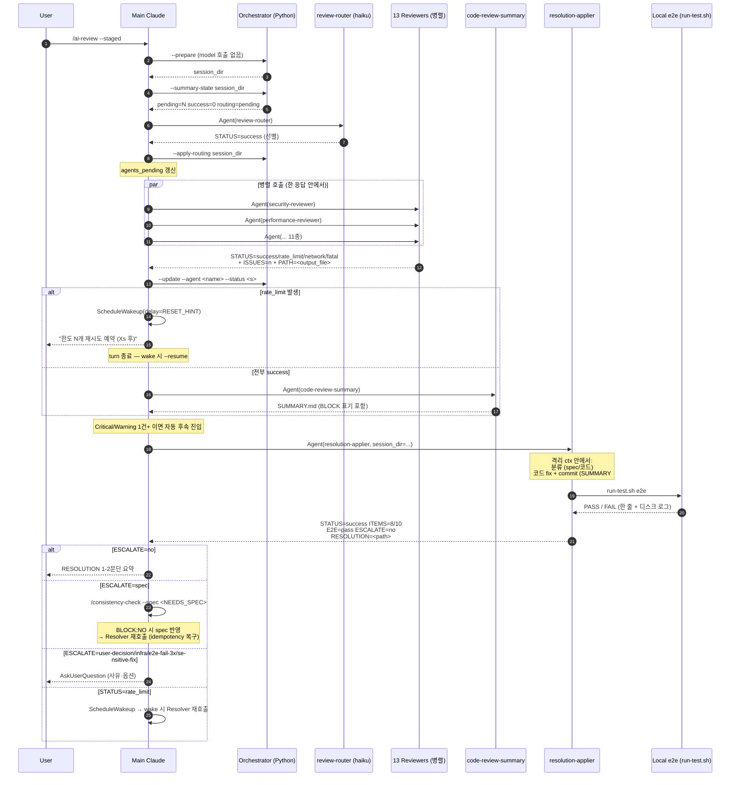
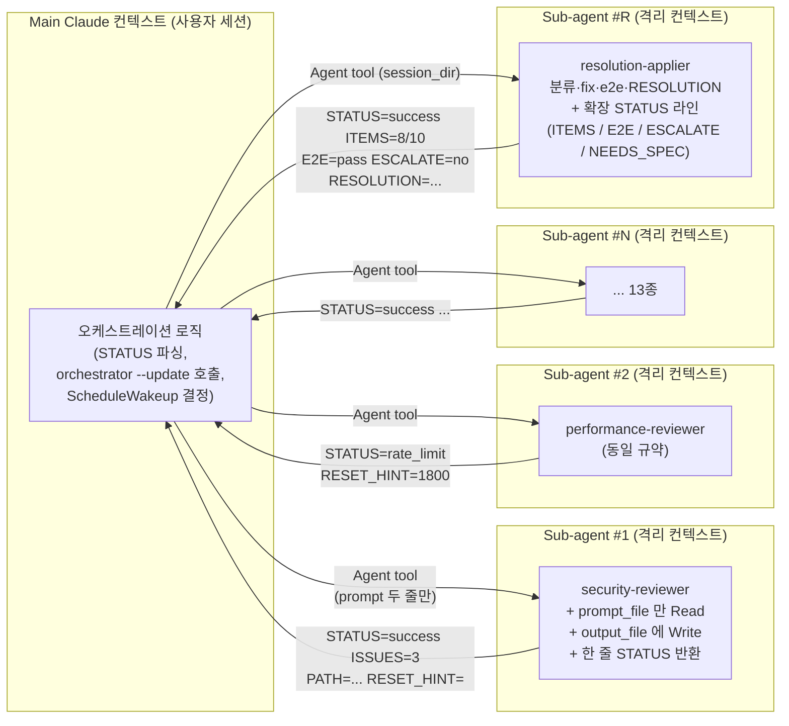
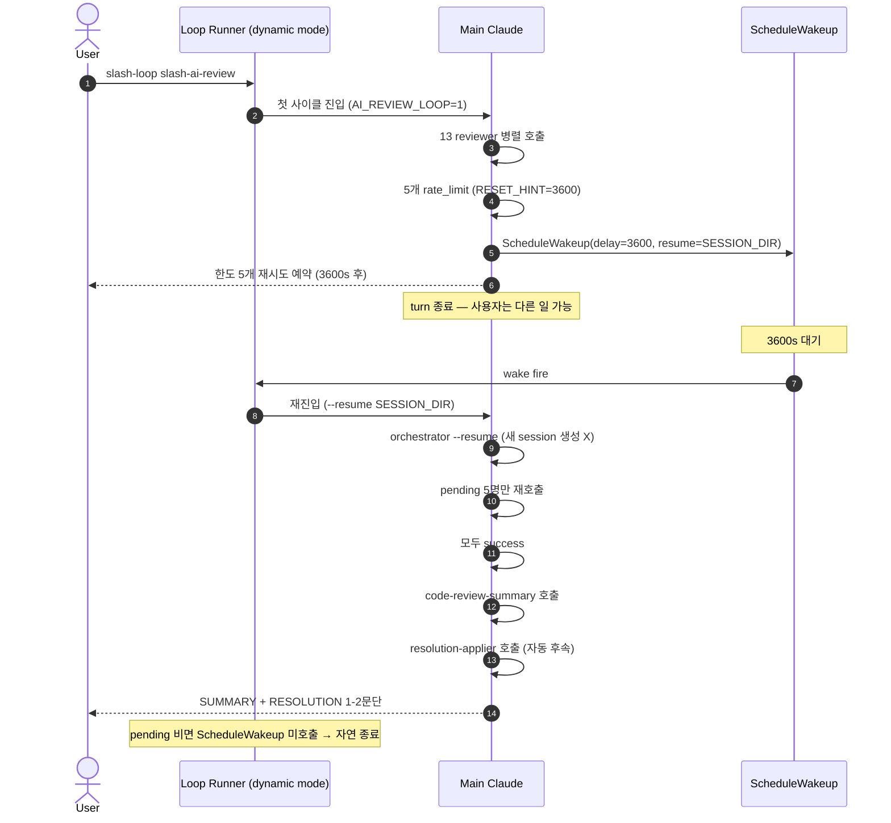
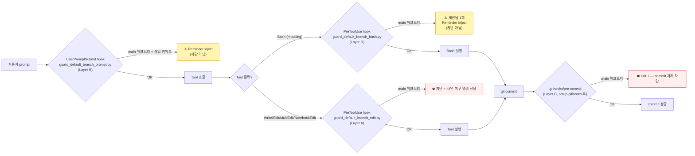
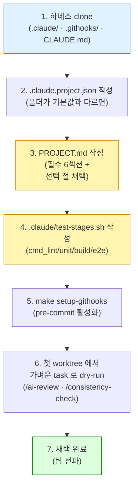

# 하네스(Harness)의 구조

> 본 문서는 **해당 하네스의 구조를 이해하기 위한 자료**입니다. 프로젝트 본체의 `CLAUDE.md` / `PROJECT.md` / `.claude/skills/**` / `.claude/docs/**` 가 SSOT(Single Source of Truth)입니다.

---

## 1. 한 줄 요약

> **"기획(Spec) → 사전 일관성 검토 → 구현(TDD) → AI 코드 리뷰 → 자동 Fix(격리 sub-agent) → e2e → PR → 다중 통합"** 전 라이프사이클을 **격리된 sub-agent + worktree + 무한 재시도 큐(/loop + ScheduleWakeup)** 위에 올린 Claude Code 전용 자동화 골격.

핵심은 세 가지입니다.

1. **역할 격리**: Main Claude 가 직접 모든 일을 하지 않고, 좁은 책임의 **sub-agent 들**을 `Agent` tool 로 invoke 해서 병렬·격리 컨텍스트에서 처리합니다.
2. **사전 게이트(BLOCK)**: spec 이 디스크에 박히기 **전**, 구현이 시작되기 **전**, 코드가 PR 로 나가기 **전** — 단계마다 자동 검토를 끼워서 잘못된 상태를 멈추게 합니다.
3. **Main ctx 보호**: AI Review 의 자동 후속 흐름(fix / e2e / RESOLUTION) 도 `resolution-applier` sub-agent 가 격리 컨텍스트에서 담당. main 으로 돌아오는 건 한 줄 STATUS + ESCALATE flag — 사용자 결정 필요한 순간만 main 으로 escalate.

---

## 2. 구성 요소 한눈에 보기



| 계층 | 구성 요소 | 역할 |
| --- | --- | --- |
| **정책 문서** | `CLAUDE.md` (78줄), `PROJECT.md` | 모든 역할이 따라야 하는 공통 규약 SSOT · 프로젝트별 매핑 |
| **공유 docs** | `.claude/docs/{worktree-policy, plan-lifecycle, subagent-call-contract, test-wrapper}.md` | 호출 시에만 lazy load 되는 상세 운영 규칙. CLAUDE.md / SKILL.md / agent definition 이 인용 |
| **Skills** | `.claude/skills/<name>/SKILL.md` | 역할별 워크플로 (planner / developer / 3 reviewer류) |
| **Sub-agents** | `.claude/agents/*.md` (28종) | 좁은 책임의 검토·실행 인격. 격리 컨텍스트 |
| **Slash commands** | `/ai-review`, `/consistency-check`, `/merge-coordinate` | Skill 진입점 |
| **Orchestrators (Python)** | `.claude/skills/<name>/scripts/*_orchestrator.py` | **model 호출 없이** 세션 디렉토리 · prompt 파일 · `_retry_state.json` 생성. `--summary-state` / `--update` / `--apply-routing` 으로 main 이 JSON 직접 Read 안 함 |
| **Tools** | `.claude/tools/{ensure-worktree, run-test}.sh` | worktree 생성 헬퍼 · TEST WORKFLOW stage 출력 truncation wrapper |
| **Hooks** | `.claude/hooks/`, `.githooks/pre-commit` | default branch 편집 차단, prompt reminder, commit 차단 |
| **Worktrees** | `.claude/worktrees/<task>-<slug>/` | 작업별 격리. main 워크트리는 통합/릴리스 전용 |
| **세션 산출물** | `review/{code,consistency,merge}/<YYYY>/<MM>/<DD>/<hh>_<mm>_<ss>/` | 모든 검토 흔적. `SUMMARY.md` + 에이전트별 결과 + `_retry_state.json` |
| **테스트 로그** | `_test_logs/<stage>-<ts>.log` | run-test.sh 가 떨어뜨림. main ctx 안 거치고 디스크 보존만 |

---

## 3. 전체 라이프사이클 — Planning 부터 PR 까지

```mermaid
flowchart TD
    Start(["요청 도착"]) --> Branch{"요청 유형?"}

    Branch -->|"기획 / Spec 수정"| Plan["project-planner skill"]
    Branch -->|"구현 / 버그 수정"| Dev["developer skill"]
    Branch -->|"다중 PR 통합"| Merge["merge-coordinator skill"]

    %% Planner path
    Plan --> WT1["0. Worktree 확인·생성<br/>(.claude/worktrees/...)"]
    WT1 --> P1["1-4. 컨텍스트 로드 · 영향 분석"]
    P1 --> P2["5. plan/in-progress/<br/>spec-draft-*.md 작성"]
    P2 --> CC1["6. /consistency-check --spec<br/>(5 checker 병렬)"]

    CC1 --> Block1{"BLOCK: YES?"}
    Block1 -->|YES| Stop1["⛔ 사용자 보고 · 재작성"]
    Block1 -->|NO| P3["7. spec/ 본문 + Rationale 반영"]
    P3 --> P4["8. plan 정리 → developer 인계"]

    %% Developer path
    P4 --> Dev
    Dev --> WT2["0. Worktree 확인·생성"]
    WT2 --> D1["1-2. spec 선독 · 모호성 해소"]
    D1 --> CC2["3. /consistency-check --impl-prep<br/>(구현 착수 직전 의무)"]

    CC2 --> Block2{"BLOCK: YES?"}
    Block2 -->|YES| Stop2["⛔ planner 위임"]
    Block2 -->|NO| D2["4. DOCUMENTATION 업데이트<br/>(i18n · docs · swagger)<br/>→ commit: docs(scope):"]

    D2 --> TDD1["5. 테스트 선작성 (TDD Red)<br/>스펙 기반으로 실패하는 테스트 먼저"]
    TDD1 --> TDD2["6. 구현 (TDD Green)<br/>테스트 통과시키는 최소 코드"]
    TDD2 --> TDD3["7. 테스트 보강 (Refactor)<br/>누락·잘못된 테스트 정리"]
    TDD3 --> TDDCommit["→ commit:<br/>feat/fix/refactor(scope):"]

    TDDCommit --> Lint["8-1. run-test.sh lint<br/>(stdout 한 줄, 디스크 보존)"]
    Lint --> LintOk{"통과?"}
    LintOk -->|FAIL| TDD3
    LintOk -->|PASS| Unit["8-2. run-test.sh unit"]

    Unit --> UnitOk{"통과?"}
    UnitOk -->|FAIL| TDD3
    UnitOk -->|PASS| Build["8-3. run-test.sh build"]

    Build --> BuildOk{"통과?"}
    BuildOk -->|FAIL| TDD3
    BuildOk -->|PASS| E2E["8-4. run-test.sh e2e<br/>(docker compose, 실 인프라)"]

    E2E --> E2EOk{"통과?"}
    E2EOk -->|FAIL| TDD3
    E2EOk -->|PASS| TestCommit["→ commit (수정 발생 시만):<br/>test(scope): / style(scope):"]

    TestCommit --> Review["9. REVIEW WORKFLOW<br/>/ai-review 호출"]

    Review --> CodeReview
    Merge --> MergeFlow

    CodeReview["/ai-review<br/>(router + 13 reviewer + summary)"] --> AutoFix["resolution-applier sub-agent<br/>(격리 ctx: 분류·fix·e2e·RESOLUTION)"]
    AutoFix --> EscalateCheck{"ESCALATE flag?"}
    EscalateCheck -->|"no"| Resolution["RESOLUTION.md 작성 완료<br/>+ commit: refactor(scope):<br/>(SUMMARY ID ↔ commit hash)"]
    EscalateCheck -->|"spec"| SpecChain["/consistency-check --spec<br/>→ BLOCK:NO 시 반영<br/>→ resolution-applier 재호출"]
    EscalateCheck -->|"user-decision / infra<br/>e2e-fail-3x / sensitive-fix"| AskUser["⚠️ AskUserQuestion<br/>사용자 결정 요청"]
    SpecChain --> AutoFix
    AskUser --> Resolution
    Resolution --> PR["PR 생성 · 사용자 검토 · merge"]

    MergeFlow["merge-coordinator<br/>4 analyzer + summary + resolver"] --> IntegrateWT["격리 worktree<br/>integrate-<slug>/"]
    IntegrateWT --> ChainReview["자동 chain:<br/>/ai-review + /consistency-check"]
    ChainReview --> PR

    PR --> Done(["완료"])

    style Stop1 fill:#fee,stroke:#c00
    style Stop2 fill:#fee,stroke:#c00
    style Block1 fill:#fff5b0,stroke:#c80
    style Block2 fill:#fff5b0,stroke:#c80
    style LintOk fill:#fff5b0,stroke:#c80
    style UnitOk fill:#fff5b0,stroke:#c80
    style BuildOk fill:#fff5b0,stroke:#c80
    style E2EOk fill:#fff5b0,stroke:#c80
    style EscalateCheck fill:#fff5b0,stroke:#c80
    style AskUser fill:#fee,stroke:#c00
```



### 3.1 TDD + TEST WORKFLOW 상세

5-8 단계를 떼어 본 흐름. 각 단계의 **실패가 발견되면 가장 가까운 수정 단계로 되돌아간다**.



**순서 근거 (왜 lint → unit → build → e2e 인가)**:

| 단계 | 소요 시간 | 실패 비용 | 의도 |
| --- | --- | --- | --- |
| lint | ~수 초 | 0 | 가장 싼 피드백 먼저. 포맷·import·simple 오류 즉시 컷 |
| unit test | 수십 초 | 0 | in-process. 인프라 없이 빠른 회귀 확인 |
| build | 수십 초 ~ 분 | 중 | `tsc` 의 타입 오류 + bundler 의 dead import 검출. **e2e 의 docker 빌드 비용(분 단위) 낭비 방지** |
| e2e | 분 단위 | 큼 | docker compose 위 multi-actor · 실 인프라 회귀 |

각 단계는 `.claude/tools/run-test.sh <stage>` wrapper 로 호출 — 통과 시 stdout 한 줄 (≤100 토큰), 실패 시 한 줄 + 마지막 30줄 + 실패 마커 grep (≤2K 토큰). 전체 로그는 `_test_logs/<stage>-<ts>.log` 디스크 보존. raw 명령 직접 호출은 main ctx 폭주 위험으로 금지.

**자동 커밋 매핑** (developer SKILL.md §단계별 자동 커밋):

| 워크플로 단계 | commit 시점 | message prefix |
| --- | --- | --- |
| 4. DOCUMENTATION | 문서 갱신 + lint 통과 직후 | `docs(<scope>):` |
| 5-7. TDD 묶음 | 단위 테스트 통과 직후 | `feat/fix/refactor(<scope>):` |
| 8. TEST WORKFLOW | 4단계 모두 통과 + **이 단계에서 수정 발생 시만** | `test(<scope>):` / `style(<scope>):` |
| 9. REVIEW (ai-review 자동 후속 포함) | 이슈 조치 + RESOLUTION.md + TEST WORKFLOW 재통과 까지 **단일 commit** | `refactor(<scope>):` 또는 `docs(review):` |
| 10. plan complete | PR 의 모든 체크박스 `[x]` + follow-up 0건 일 때만 | `chore(plan): mark <name> complete` |

> **--amend 금지 · `git add -A` 금지 · pre-commit hook `--no-verify` 금지**. 각 단계가 atomic commit 으로 분리되어, 사후 bisect / revert 가 항상 가능.

### 단계별 산출물 요약

| 단계 | 살아있는 산출물 | 시점 산출물 (감사 흔적) |
| --- | --- | --- |
| 기획 | `spec/<영역>/*.md` (Overview · 본문 · Rationale 3섹션) | `review/consistency/<…>/SUMMARY.md` |
| 구현 | `codebase/{frontend,backend}/**`, `plan/in-progress/<task>.md` | (단계별 자동 commit) |
| 사전 검토 | (없음 — 차단만) | `review/consistency/<…>/{SUMMARY.md, <checker>.md}` |
| 사후 리뷰 | `review/code/<…>/RESOLUTION.md` (resolution-applier 또는 구현자 작성) | `review/code/<…>/{SUMMARY.md, <role>.md, _routing_decision.json, _resolution_state.json, _resolution_log.md}` |
| 다중 통합 | `.claude/worktrees/integrate-<slug>/` | `review/merge/<…>/{SUMMARY.md, <analyzer>.md, _conflicts/*.{md,patch}}` |
| Plan 종료 | `plan/complete/<name>.md` (git mv) | — |

---

## 4. AI Review 자동 후속 흐름 (Sequence)

`/ai-review` 가 단순한 "조언" 이 아니라, **수정 → e2e → RESOLUTION 까지 자동으로 끝내는** 닫힌 루프입니다. **자동 후속 처리는 resolution-applier sub-agent 가 격리 컨텍스트에서 담당** — main 으로 돌아오는 건 한 줄 STATUS + ESCALATE flag 뿐.



### 핵심 안전 가드 — resolution-applier 의 ESCALATE 매트릭스

자동 진행을 **중단하고 main 으로 escalate** 하는 사유:

| ESCALATE | 조건 | main 의 후속 |
| --- | --- | --- |
| `no` | 모든 항목 처리 + e2e 통과 + spec 변경 0건 | 사용자에게 1-2문장 보고 + 종료 |
| `spec` | spec 관련 항목 있음 — draft 만 작성 후 main 으로 위임 | `/consistency-check --spec` 자동 chain |
| `user-decision` | SUMMARY 가 "사용자 결정 필요" 명시 | AskUserQuestion |
| `infra` | docker daemon 미동작, 디스크 부족 등 환경 차단 | AskUserQuestion + 환경 복구 안내 |
| `e2e-fail-3x` | e2e 3회 연속 실패 | AskUserQuestion + 부분 RESOLUTION |
| `sensitive-fix` | DB 마이그레이션, 외부 API 계약, 인증 흐름 등 위험한 자동 수정 | AskUserQuestion + 변경 사항 표시 |

**원칙**: 의심 시 ESCALATE=yes 가 default. 자동 진행이 위험할 때 sub-agent 가 마음대로 진행하지 않는다.

**idempotency 보장**: resolution-applier 가 중간 종료돼도 `_resolution_state.json` + git log (commit 메시지의 `SUMMARY#<n>` 인용) + RESOLUTION.md 로 복구. main 은 같은 session_dir 로 재호출만 하면 됨.

---

## 5. Sub-agent 격리 모델



**왜 이렇게 설계했는가?**

1. **Main 컨텍스트 보호**: reviewer 13개의 분석 결과 + resolution-applier 의 fix·e2e 로그가 main 의 토큰 윈도우에 쌓이지 않습니다. Main 은 한 줄 STATUS 만 봅니다.
2. **병렬 처리**: 한 응답 안에서 multiple `Agent` tool call → 13개가 동시에 돌아갑니다.
3. **재시도 단순화**: STATUS=rate_limit 으로 분류된 agent 만 다음 wake 사이클에서 다시 호출 — 성공한 것은 건드리지 않습니다.
4. **상태 echo 화**: orchestrator 가 `--summary-state` / `--update` 로 한 줄만 echo — main 이 `_retry_state.json` JSON 자체를 Read 하지 않음.
5. **idempotency**: resolution-applier 는 디스크 상태(_resolution_state.json + git log + RESOLUTION.md)가 진실의 원천. 중단 후 재호출도 안전.

---

## 6. 사용량 한도(Rate Limit) 무한 재시도 (`/loop` + ScheduleWakeup)

요금제 정책상 외부 LLM 호출 (`claude -p`, Anthropic SDK 직접) 이 모두 금지되어, 모든 model 호출이 main session 의 한도를 공유합니다. 한도가 걸리면:



> 다이어그램에서 `slash-loop`, `slash-ai-review`, `Loop Runner` 는 Mermaid `sequenceDiagram` 의 `loop` 키워드와 충돌을 피하기 위한 표기입니다. 실제 명령은 `/loop /ai-review` 이고 dynamic mode 진입점은 `/loop` 스킬입니다.

특징:
- **세션 디렉토리 영속화**: `--resume <session_dir>` 인자로 같은 세션 재진입. `_retry_state.json` 이 상태 SSOT.
- **RESET_HINT 최대값**: 여러 reviewer 의 hint 중 가장 큰 값 사용 → 가장 늦게 풀리는 한도 기준 안전 마진.
- **fatal 은 재시도 안 함**: rate_limit / network 만 pending 유지.
- **resolution-applier 도 동일 재시도 흐름**: idempotency 로 중단 후 재진입도 안전 (디스크 상태가 진실).

---

## 7. Worktree 기반 작업 분리 (4-layer 자동 차단)

> Main 워크트리(= default branch) 는 **통합·릴리스 전용**. 모든 신규 작업은 `.claude/worktrees/<task>-<slug>/` 에서.



| Layer | 위치 | 시점 | 효과 | 우회 |
| --- | --- | --- | --- | --- |
| A. PreToolUse (edit) | `.claude/hooks/guard_default_branch_edit.py` | Write/Edit/MultiEdit/NotebookEdit 직전 | **차단** + 사유·복구 명령 전달 | `BYPASS_DEFAULT_BRANCH_GUARD=1` |
| B. UserPromptSubmit | `.claude/hooks/guard_default_branch_prompt.py` | 사용자 prompt 진입 | Reminder inject (안내) | — |
| C. pre-commit (git) | `.githooks/pre-commit` | `git commit` 직전 | exit 1 로 차단 | `BYPASS_DEFAULT_BRANCH_GUARD=1` |
| D. PreToolUse (bash) | `.claude/hooks/guard_default_branch_bash.py` | mutating Bash (npm/git commit/mkdir/...) 직전 | 세션당 1회 Reminder inject (안내) | — |

- 모두 같은 정책 모듈(`.claude/hooks/_lib/branch_guard.py`) 공유. 차단 조건: 최상위 `.git` 이 **디렉토리** (== main worktree) **AND** 현재 branch == origin default branch.
- Layer D 의 의도: A 의 차단이 늦게 발동하면 모델이 main 에서 Read/Grep 등으로 sunk-cost 컨텍스트를 쌓은 뒤에야 깨닫게 된다. 첫 mutating Bash 명령 시점에 안내를 주어 worktree 결정을 일찍 노출 (재시작 비용이 낮을 때).
- 안내가 가리키는 canonical 복구 명령: `.claude/tools/ensure-worktree.sh <task_name>` → 출력 마지막 줄 `cd ...` 실행.
- **e2e 자동 격리**: `make e2e-*` 가 worktree dir basename 으로 compose project name 도출 → 컨테이너·볼륨·network 가 worktree 별 분리. 여러 worktree 가 동시에 e2e 돌려도 충돌 없음.

상세: [`.claude/docs/worktree-policy.md`](.claude/docs/worktree-policy.md).

---

## 8. Sub-agent 목록 (총 28개)

### 8.1 Code Review (13 reviewers + 1 router + 1 summary + 1 resolution-applier)

| 분야 | sub-agent | 핵심 관점 |
| --- | --- | --- |
| 보안 | `security-reviewer` | 인젝션 · 시크릿 · OWASP Top 10 |
| 성능 | `performance-reviewer` | 복잡도 · N+1 · 메모리 · 캐싱 |
| 아키텍처 | `architecture-reviewer` | SOLID · 결합도 · 순환 의존성 |
| 요구사항 | `requirement-reviewer` | 기능 완전성 · 의도-구현 괴리 |
| 범위 | `scope-reviewer` | 의도 이상 변경 · 무관 수정 |
| 부작용 | `side-effect-reviewer` | 전역 변수 · 시그니처 변경 |
| 유지보수성 | `maintainability-reviewer` | 가독성 · 네이밍 · 중복 |
| 테스트 | `testing-reviewer` | 테스트 존재 · 커버리지 갭 |
| 문서 | `documentation-reviewer` | docstring · README · API 문서 |
| 의존성 | `dependency-reviewer` | 새 의존성 · 라이선스 · 취약점 |
| DB | `database-reviewer` | 인덱스 · 트랜잭션 · 마이그레이션 |
| 동시성 | `concurrency-reviewer` | race · deadlock · async/await |
| API 계약 | `api-contract-reviewer` | 하위 호환성 · 응답 포맷 |
| 라우팅 | `review-router` (haiku) | 변경 성격에 따라 reviewer 선별 |
| 통합 | `code-review-summary` | 결과 통합 → `SUMMARY.md` |
| **자동 후속** | `resolution-applier` | **분류·코드 fix·spec draft·e2e·RESOLUTION 모두 격리 ctx 에서 수행. 사용자 결정 필요한 순간만 main 으로 ESCALATE** |

### 8.2 Consistency Check (5 checkers + 1 summary)

| sub-agent | 검출 대상 |
| --- | --- |
| `cross-spec-checker` | 다른 영역 spec 의 데이터 모델 · API · 요구사항 ID 충돌 |
| `rationale-continuity-checker` | 과거 Rationale 에서 기각된 결정의 재도입 |
| `convention-compliance-checker` | `spec/conventions/**` 정식 규약 위반 |
| `plan-coherence-checker` | 진행 중 plan 의 미해결 결정 · worktree 충돌 |
| `naming-collision-checker` | 신규 식별자의 기존 사용처 중복 |
| `consistency-summary` | 5 결과 통합 → `BLOCK: YES/NO` 결정 |

### 8.3 Merge Coordination (4 analyzer + 1 summary + 1 resolver)

| sub-agent | 역할 |
| --- | --- |
| `merge-conflict-analyzer` | text-level git conflict 예측 |
| `semantic-conflict-analyzer` | signature · behavior · invariant 충돌 |
| `integration-order-planner` | 의존성 그래프 · 통합 순서 |
| `cross-branch-spec-analyzer` | branch 간 spec/plan 영역 충돌 |
| `integration-risk-summary` | 4 결과 통합 + BLOCK 결정 |
| `merge-conflict-resolver` | 단일 conflict 의 unified diff patch 제안 |

모든 sub-agent 의 공통 호출 규약(prompt_file/output_file/STATUS 라인·재시도 정책)은 [`.claude/docs/subagent-call-contract.md`](.claude/docs/subagent-call-contract.md) 가 SSOT — agent definition 들은 한 줄로 인용만.

---

## 9. 강점 (Strengths)

### 9.1 사전 게이트로 잘못된 상태가 박히는 것을 막는다
- `consistency-checker` 가 spec 쓰기 직전 / 구현 착수 직전 두 시점에 의무 호출됩니다.
- Critical 발견 시 `BLOCK: YES` 가 `SUMMARY.md` 상단에 박혀, Main Claude 가 즉시 호출자(planner / developer)를 멈춥니다.
- "수정 후 검토" 가 아니라 **"검토 후 수정"** — 잘못된 spec 이 디스크에 반영된 뒤 되돌리는 비용을 회피.

### 9.2 닫힌 루프 (Review → Fix → e2e → RESOLUTION) — 격리 sub-agent 위에서
- `/ai-review` 가 단순 조언이 아니라 **resolution-applier sub-agent 의 격리 컨텍스트 안에서 자동 fix + 로컬 e2e 의무 실행 + RESOLUTION.md 작성** 까지 일관 처리.
- main ctx 누적이 격리 sub-agent 로 옮겨가서 한 사이클당 40-130K 토큰 절감.
- `[skip-e2e]` · "CI 가 처리할 것" · "단위 테스트로 충분" 모두 **금지** → 실패가 production 으로 새지 않습니다.
- e2e 실패 최대 3회 자동 재시도 → 일시적 flake 는 자가 회복. 3회 실패 시 `ESCALATE=e2e-fail-3x` 로 main escalate.

### 9.3 Main 컨텍스트 보호 (Sub-agent 격리)
- 13개 reviewer 의 결과 + resolution-applier 의 fix·e2e 로그가 main 토큰 윈도우를 잠식하지 않습니다 (한 줄 STATUS 만 반환).
- Main 은 짧은 결정 로직(분류·재시도·schedule) 만 담당 → 긴 세션에서도 안정.
- 결과는 모두 파일(`output_file` · `RESOLUTION.md` · `_resolution_log.md`) 에 박혀 사후 감사 가능.
- TEST WORKFLOW 의 lint/unit/build/e2e 도 `.claude/tools/run-test.sh` wrapper 가 출력을 truncate — 통과 시 한 줄, 실패 시 30줄만 main 으로.

### 9.4 사용량 한도 처리 자동화
- 한도가 걸려도 사용자가 다른 일을 할 수 있음 (`ScheduleWakeup` + `/loop dynamic mode`).
- `_retry_state.json` 으로 세션 상태가 영속화 → 실패한 agent 만 다시 호출, 성공한 결과는 보존.
- resolution-applier 도 `_resolution_state.json` 으로 idempotency 보장 — 중간 한도에 걸려도 재진입 시 처리된 SUMMARY 항목 자동 skip.
- RESET_HINT 최대값 전략으로 over-polling 방지.

### 9.5 Worktree 기반 병렬 작업
- 여러 작업이 같은 코드베이스에서 충돌 없이 진행 (e2e 인프라까지 자동 격리).
- main worktree 는 통합·릴리스 전용 → default branch 가 "merge-only" 보장.
- 4-layer 자동 차단(hook A · B · C · D) 으로 모델 자율 준수에 의존하지 않음. A·C 는 차단, B·D 는 안내.

### 9.6 단일 진실 원칙 (Spec SSOT + .claude/docs/ SSOT)
- 모든 결정이 `spec/<영역>/*.md` 에 모임 (Overview · 본문 · Rationale 3섹션).
- 옛 PRD · ADR · memory 폴더가 모두 `spec/` 으로 흡수.
- 하네스 운영 규칙은 CLAUDE.md (78줄) + `.claude/docs/` 4개 doc 으로 분리 — 호출 시에만 lazy load 되어 매 turn ctx 부담 ≈ 5-7K 토큰 절감.
- 결정 변경 시 항상 Rationale 에 폐기된 대안 명시 → `rationale-continuity-checker` 가 재도입 검출.

### 9.7 감사 가능성 (Audit Trail)
- 모든 검토 세션이 `review/{code,consistency,merge}/<YYYY>/<MM>/<DD>/<hh>_<mm>_<ss>/` 에 보존.
- `SUMMARY.md` + 에이전트별 결과 + `_retry_state.json` + (ai-review) `_resolution_state.json` + `_resolution_log.md` 로 **어떤 판정과 어떤 자동 수정으로 PR 이 나갔는지** 재현 가능.
- 자동 fix commit 메시지에 `SUMMARY#<n>` 인용 강제 → SUMMARY 항목 ↔ commit 매핑이 git log 만으로 추적 가능.

### 9.8 Router 로 비용 최적화
- haiku 기반 `review-router` 가 변경 성격을 보고 13개 중 필요한 reviewer 만 선별.
- 강제 포함 화이트리스트(`agents_forced`) 로 보안 등 핵심 항목은 router 가 끄지 못함.

---

## 10. 약점 (Weaknesses) · 주의점

### 10.1 학습 곡선이 가파르다
- CLAUDE.md (78줄, lean) + `.claude/docs/` 4개 doc + PROJECT.md + SKILL.md 5종 + sub-agent 28종의 규약을 이해해야 효과 발휘.
- 신규 합류자는 "왜 main 에서 편집이 안 되지?" 같은 한 hook 한 hook 에 막힘.
- **완화책**: 본 문서 같은 큰 그림 문서 + 1:1 페어 진입.

### 10.2 단일 Anthropic 한도에 종속
- 모든 sub-agent 호출이 main session 의 한도를 공유 (외부 SDK 호출 금지 정책).
- 큰 PR · 다중 통합 · /ai-review 자동 후속 흐름이 겹치면 한도 소진 빠름.
- `/loop` 무한 재시도로 완화되지만, **벽 시간(wall-clock)** 은 늘어남.
- 멀티 테넌트 (여러 개발자가 같은 Anthropic 키 공유) 환경에서 더 심각.

### 10.3 자동 후속 흐름의 폭주 위험
- resolution-applier 의 ESCALATE 매트릭스(6분기)가 안전 가드 역할 — `sensitive-fix` 분기로 DB 마이그레이션 · 외부 API 계약 · 인증 흐름 변경은 자동 수정 안 함.
- 다만 "민감 변경" 판정 자체가 모델 자체에 의존 — false-negative (자동 수정한 후 사고) 위험은 0 이 아님.
- **완화책**: 화이트/블랙리스트를 PROJECT.md 에 명시적으로 박는 작업 권장.

### 10.4 세션 디렉토리 누적
- 모든 검토가 `review/{code,consistency,merge}/<YYYY>/<MM>/<DD>/<hh>_<mm>_<ss>/` 에 박혀 누적.
- 옛 flat 경로 폭주 문제로 nested ISO 로 전환했지만, 장기 보존 정책이 정의되어 있지 않음.
- 추가로 `_test_logs/<stage>-<ts>.log` 가 누적 — `.gitignore` 처리 + 주기적 청소 필요 (`find _test_logs -mtime +7 -delete`).
- 일정 시점 이전 데이터를 cold storage 로 이관하는 자동화가 없음.

### 10.5 e2e 의무가 환경 의존
- 로컬에서 Docker compose 가 돌아야 e2e 통과 → 환경이 안 맞으면 `ESCALATE=infra` 로 자동 흐름 중단.
- 화이트리스트(`PROJECT.md §e2e 면제 화이트리스트`) 가 좁아, 회색 지대(테스트만 변경, helper 한 줄) 도 e2e 필수.
- 빠른 실험·prototyping 사이클에는 부담.

### 10.6 다중 sub-agent 호출의 race
- "한 응답 안에서 multiple Agent tool calls" 가 핵심 패턴인데, model 이 가끔 순차 호출하는 경우가 있음.
- 그러면 한도 소진 + 벽 시간 모두 악화. SKILL.md 의 강조에도 불구하고 일관성 확보가 어려움.

### 10.7 Worktree 정리가 수동
- 작업이 PR 머지되면 worktree 를 정리해야 하는데, 자동 GC 가 없음.
- `make e2e-prune` 으로 docker 쪽 stale 은 정리되지만 worktree 자체는 사용자가 `git worktree remove` 해야 함.
- 누적되면 디스크 사용량 증가.

### 10.8 Spec / 코드 동기화는 여전히 인간 책임
- developer 가 "spec 모호 / 부족" 을 발견하면 멈추고 planner 로 위임해야 하는데, 모델이 "현장에서 적당히 결정" 하는 fallback 이 없음 (의도된 설계지만 흐름 단절).
- spec 변경이 잦은 단계에서는 planner ↔ developer 핑퐁이 자주 발생.
- resolution-applier 의 `ESCALATE=spec` 분기로 자동 chain 이 일부 완화하지만, 큰 spec 결정은 여전히 사용자 결정 필요.

### 10.9 정책 위반 검출의 한계
- 일관성 checker 가 검출하는 것은 spec/plan 의 위배 — **코드와 spec 의 괴리** 는 사후 `/ai-review` 의 `requirement-reviewer` 한 종에만 의존.
- spec 이 변경됐는데 코드가 따라가지 않은 경우의 자동 검출이 약함.

### 10.10 진입 비용 vs 효익의 비대칭
- 1-2시간짜리 작은 task 에는 (consistency-check + worktree + ai-review + resolution-applier + e2e + RESOLUTION) 오버헤드가 큼.
- 작은 변경에는 일부 단계를 우회하고 싶은 유혹이 있는데, 우회 흔적이 코드 곳곳에 남으면 정책 자체의 권위가 약해짐.

---

## 11. 프로젝트별 설정 파일 — `.claude.project.json` · `PROJECT.md` · `.claude/test-stages.sh`

본 하네스는 generic 화되어 있어, **하나의 `.claude/` 골격으로 여러 저장소에서 재사용** 할 수 있도록 설계되어 있습니다. 저장소마다 다른 세 가지는 외부 파일에 분리됩니다.

| 파일 | 형식 | 읽는 주체 | 역할 |
| --- | --- | --- | --- |
| `.claude.project.json` | JSON | Python orchestrator (`_lib/project_config.py`) | **경로(폴더 위치) 재배치만** 담당. 키 누락 시 모두 기본값 |
| `PROJECT.md` | Markdown | Main Claude · Skill 워크플로 (`developer/SKILL.md` 등) | **명령·매핑·도메인 어휘** 의 단일 진실. 하네스 generic skeleton 이 본 문서를 참조 |
| `.claude/test-stages.sh` | Bash | `.claude/tools/run-test.sh` | **TEST WORKFLOW 4단계 실제 명령**. `cmd_lint`/`cmd_unit`/`cmd_build`/`cmd_e2e` 함수 정의 |
| `CLAUDE.md` (+ `.claude/docs/`) | Markdown | Main Claude · 모든 sub-agent | **공통 규약·정책** (하네스 자체. 프로젝트 가로질러 동일) |

> 이 셋을 분리한 이유: `CLAUDE.md` 는 하네스 자체 (모든 프로젝트 동일), `PROJECT.md` 는 사람이 결정해야 하는 프로젝트별 컨벤션, `.claude.project.json` 은 코드가 자동으로 읽는 경로 매핑, `.claude/test-stages.sh` 는 wrapper 가 source 하는 실행 명령. 책임이 다르면 파일도 다르다.

---

### 11.1 `.claude.project.json` — 경로 재배치 (Machine-readable)

**목적**: 본 저장소의 폴더 배치가 하네스 기본값과 다를 때, **Python orchestrator 가 어디서 spec / plan / review 산출물을 찾고 쓸지** 알려준다. 키는 전부 optional 이고, 누락 시 기본값으로 동작한다.

**누가 읽는가**: `.claude/skills/_lib/project_config.py` 의 `load(repo_root)` 함수.
모든 orchestrator (`code_review_orchestrator.py`, `consistency_orchestrator.py`, `merge_coordinator_orchestrator.py`) 가 진입 시점에 호출 → 경로 상수로 사용.

**스키마 (모든 키 optional)**:

```jsonc
{
  "corpora": {
    "spec":             "spec",                // 제품 spec SSOT 루트
    "conventions":      "spec/conventions",    // 정식 규약 폴더
    "plan_in_progress": "plan/in-progress",    // 진행 중 plan
    "plan_complete":    "plan/complete"        // 완료 plan
  },
  "outputs": {
    "review_code":        "review/code",         // /ai-review 세션 디렉토리 부모
    "review_consistency": "review/consistency",  // /consistency-check 부모
    "review_merge":       "review/merge"         // /merge-coordinate 부모
  },
  "code_areas": ["codebase"]                   // 코드베이스 루트 목록 (배열)
}
```

**언제 작성해야 하는가**

| 상황 | 작성 필요성 |
| --- | --- |
| 모든 폴더가 하네스 기본값과 동일 | **작성 불필요** — 파일 없어도 동작 |
| 코드가 `src/` · `app/` 등 비표준 위치 | `code_areas` 만 override |
| spec 을 `docs/spec/` 에 둠 | `corpora.spec` override (+ 하위 경로 일관성 유지) |
| 리뷰 산출물을 별도 저장소나 외부 경로로 옮기고 싶음 | `outputs.*` override |
| 멀티 코드베이스 (예: `services/api/`, `services/worker/`) | `code_areas: ["services/api", "services/worker"]` |

**작성 시 주의점**

- **개념(concept) 자체는 바꿀 수 없다** — `corpora.spec` 의 위치는 옮길 수 있지만 "spec corpus 라는 개념" 자체는 하네스 계약의 일부 (CLAUDE.md "폴더 구조" 참고). spec 폴더가 없으면 consistency-checker / project-planner 가 동작 불가.
- **얕은 merge (one-level deep)**: `corpora` 객체 안에서 일부 키만 override 가능. 모든 키를 다시 쓸 필요 없음.
- **unknown 키 보존**: 미래 스키마 확장에 forward-compatible — 모르는 키는 그대로 둠.
- **파일 부재 = 기본값**: 파일 없거나 JSON 파싱 실패해도 fail-open (orchestrator 가 멈추지 않음).

**예시 — 기본값과 다른 경우**

```jsonc
{
  "_schema": ".claude.project.json — see .claude/skills/_lib/project_config.py",
  "corpora": {
    "spec":             "docs/product-spec",
    "plan_in_progress": "tracking/in-progress",
    "plan_complete":    "tracking/complete"
  },
  "code_areas": ["services/api", "services/worker", "packages"]
}
```

---

### 11.2 `PROJECT.md` — 프로젝트 컨벤션 계약 (Human-readable)

**목적**: 하네스 generic skeleton 이 "이 저장소에서 코드를 어떻게 빌드·테스트하고, 어떤 문서를 함께 갱신해야 하는지" 알아야 동작한다. `PROJECT.md` 는 그 **프로젝트별 매핑·명령·규약의 단일 진실**.

**누가 읽는가**: Main Claude 가 SKILL.md 단계마다 본 문서를 참조. 특히:
- `developer/SKILL.md` 의 TEST WORKFLOW (4단계 명령 — 실제 실행은 `.claude/test-stages.sh` 가 담당)
- `developer/SKILL.md` §4 DOCUMENTATION 업데이트 단계
- `/ai-review` 자동 후속 흐름 — resolution-applier 가 e2e 면제 화이트리스트 참조
- `/consistency-check` 의 `--impl-prep` 모드

> **PROJECT.md 가 없으면 하네스 채택이 미완** — `developer/SKILL.md` 가 본 파일을 명시적 dependency 로 잡고 있다 ("PROJECT.md 가 없으면 본 하네스 채택이 미완 — 작업 전 작성을 요청한다").

**필수 섹션 (생략 시 하네스 동작에 직접 영향)**

| § | 섹션 | 목적 / 누가 읽는가 |
| --- | --- | --- |
| 1 | **코드베이스 구조** | 어떤 폴더에 어떤 스택. 변경 PR 의 영향 범위 추정. SKILL.md 의 "코드베이스" 언급은 여기를 참조 |
| 2 | **빌드·린트·테스트 명령** | TEST WORKFLOW 의 lint / unit / build / e2e **각 단계의 실제 명령** + Cross-stack 의무 단락 (멀티-stack 이면 wrapper 가 양쪽 묶음 강제). `.claude/test-stages.sh` 에 같은 명령을 함수로 박는다 |
| 3 | **e2e 면제 화이트리스트** | "이 변경 set 만이면 e2e 안 돌려도 된다" 의 부분집합 규칙. **임의 확대 금지** — 추가는 PR 로 본 문서 갱신 |
| 4 | **변경 유형 → 갱신 위치 매핑** | 코드 변경마다 함께 갱신해야 할 문서·번역·swagger·migration 테이블. 누락 검출 가드 |
| 5 | **e2e 테스트 작성 가이드** | 언제 e2e 를 작성하는가, 파일 위치·명명, 패턴 / 헬퍼 / 응답 shape, 알려진 우회 |
| 6 | **도메인 어휘** | 노드 카테고리, 표현식, 인프라 의존, 규약 폴더 등 — sub-agent 가 짧은 prompt 만 받아도 맥락을 잃지 않도록 |

**방법론 절 (템플릿에 baked-in — 인프라명·실측 사례만 채우면 됨)**

- **e2e 실행 원칙** — 회피 안티패턴(6가지) + 실행 사전 체크리스트(6단계) + 자주 누락되는 turn 패턴. `[skip-e2e]` 자체 발급 금지 등 RESOLUTION.md e2e 줄 4형식 차단 정책의 자가 점검 가이드
- **사후 보정 PR 패턴 금지 — 같은 turn 원칙** + DOCUMENTATION 단계 종료 사전 체크리스트. `fix(i18n):` · `fix(docs):` 별 commit 패턴을 코드 변경과 같은 turn 안에서 차단
- **Worktree 별 e2e 자동 격리** (빌드 명령 표 직후 단락) — compose project name 을 worktree basename 으로 도출해 동시 e2e 충돌 방지

**선택 섹션 (프로젝트 사정에 따라 채택·삭제)**

- **유저 가이드 파일 컨벤션** — in-repo 사용자 가이드/문서를 `user-guide-writer` sub-agent 로 위임할 때. SoT 문서 인덱스 + 자주 누락 작성 패턴 + 자가 검증 체크리스트
- **i18n dict 파일 컨벤션** — i18n dict 를 단일 거대 파일이 아닌 섹션별로 split 할 때
- **자동 가드 (build-time 차단)** — i18n parity · spec frontmatter · enum exhaustiveness · user-guide reverse-coverage 등 결정적 단위 테스트로 누락 검출
- **알려진 backend/frontend quirk · 우회** — e2e 헬퍼가 풀어주는 한도·인증·세션 문제 등
- e2e 화이트리스트 밖이지만 보류가 정당한 경우 — 사용자 명시 승인 절차

**작성 시 주의점**

- **본 문서가 길어진다 = 정상**. 하네스의 generic skeleton 이 본 문서에 외주를 줬다는 뜻 — 비대해지는 것이 의도된 설계.
- **명령은 그대로 복붙 가능한 형태**: 추상화 (`<your-test-command>`) 가 아니라 즉시 실행 가능한 명령 (`cd codebase/backend && npm run lint`).
- **e2e 화이트리스트는 닫혀있어야 안전**: "회색 지대(예: `*.test.ts` 만 변경, helper 한 줄) 도 화이트리스트가 아니므로 e2e 수행" — 의도적으로 좁게.
- **변경 유형 매핑은 검증 명령을 함께 명시**: 표 우측에 단위 테스트 명령을 두어, developer 가 갱신 후 그 자리에서 검증할 수 있게.
- **PROJECT.md 변경 = PR 단위**: 화이트리스트 확대 / 새 변경 유형 매핑 추가 모두 별 PR 로 합의 후 반영. 코드 변경과 같은 PR 에 끼워넣지 않는다.

---

### 11.3 `.claude/test-stages.sh` — TEST WORKFLOW 실행 명령

**목적**: `.claude/tools/run-test.sh` wrapper 가 source 하는 함수 집합. 통과 시 stdout 한 줄, 실패 시 한 줄 + 마지막 30줄 + 실패 마커 grep — main ctx 폭주 방지.

**누가 읽는가**: `.claude/tools/run-test.sh` (bash). developer SKILL.md 와 resolution-applier sub-agent 가 호출 의무.

**파일은 그냥 함수 정의**:

```bash
cmd_lint()  { cd codebase/backend && npm run lint; }
cmd_unit()  { cd codebase/backend && npm test; }
cmd_build() { cd codebase/backend && npm run build; }
cmd_e2e()   { make e2e-test; }
```

**작성 시 주의점**

- **PROJECT.md §빌드·린트·테스트 명령** 표의 명령과 1:1 일치해야 함. 두 곳에서 SSOT 가 갈리면 자동 흐름이 깨짐.
- 함수가 직접 exit code 를 반환하도록 — wrapper 가 그 값으로 PASS/FAIL 판정.
- 함수 안에서 `set -e` 같은 strict mode 는 wrapper 가 이미 잡고 있으니 필요 없음.
- 채택 시 `cp .claude/test-stages.sh.example .claude/test-stages.sh` 로 시작.

---

### 11.4 다른 프로젝트 적용 시 작성 순서



가장 비중이 큰 단계는 **§3 PROJECT.md 작성**. 필수 6 섹션 + 방법론 절(e2e 실행 원칙 · 사후 보정 PR 패턴 금지)의 placeholder 를 모두 채워야 자동 흐름이 안전하게 돈다. 선택 절(유저 가이드 컨벤션 · i18n dict 컨벤션 · 자동 가드 목록)은 프로젝트 사정에 따라 채택·삭제. **§4 test-stages.sh** 는 PROJECT.md 의 명령을 함수로 옮기는 단순 작업.

---

## 12. 채택 시 권장 순서

다른 프로젝트에 본 하네스를 도입할 때:

1. **CLAUDE.md (+ `.claude/docs/`) + PROJECT.md 작성**: 공통 규약 + 프로젝트별 매핑(빌드/테스트 명령, e2e 화이트리스트 등).
2. **`.claude/test-stages.sh` 작성**: PROJECT.md 의 명령을 함수로 박음.
3. **Worktree 정책 + 4-layer hook** 활성화 (`make setup-githooks`). A·B·D 는 `.claude/settings.json` 등록만으로 자동 동작, C 는 `make setup-githooks` 후 활성화.
4. **Skills 도입 순서**: `developer` → `consistency-checker` → `code-review-agents` → `project-planner` → `merge-coordinator`.
5. **e2e 자동 격리** (compose project name = worktree basename) 설정.
6. **/loop + ScheduleWakeup** 사용 컨벤션 사내 공유.
7. **review 폴더 보존 정책 + `_test_logs/` 정리 정책** 결정 (예: 90일 후 cold storage).

---

## 13. 참고 문서

| 항목 | 경로 |
| --- | --- |
| 공통 규약 (짧은 SSOT) | `CLAUDE.md` |
| Worktree 정책 상세 | `.claude/docs/worktree-policy.md` |
| Plan 라이프사이클 | `.claude/docs/plan-lifecycle.md` |
| Sub-agent 호출 규약 (공통) | `.claude/docs/subagent-call-contract.md` |
| Test wrapper 사용법 | `.claude/docs/test-wrapper.md` |
| 프로젝트별 매핑 | `PROJECT.md` |
| 기획자 워크플로 | `.claude/skills/project-planner/SKILL.md` |
| 개발자 워크플로 | `.claude/skills/developer/SKILL.md` |
| 사전 검토 | `.claude/skills/consistency-checker/SKILL.md` |
| 사후 리뷰 + 자동 후속 위임 | `.claude/skills/code-review-agents/SKILL.md` |
| 자동 후속 흐름 (resolution-applier) | `.claude/agents/resolution-applier.md` |
| 다중 통합 | `.claude/skills/merge-coordinator/SKILL.md` |
| Sub-agent 정의 (28종) | `.claude/agents/*.md` |
| Slash commands | `.claude/commands/{ai-review,consistency-check,merge-coordinate}.md` |
| Hooks | `.claude/hooks/`, `.githooks/pre-commit` |

---

> FAQ:
> 1. "Sub-agent 도 결국 같은 Anthropic 키 한도를 먹는 것 아닌가?" → 맞음. 단 context window 격리 효과 + 병렬성으로 시간 단축. 한도 자체는 `/loop` 로 완화.
> 2. "왜 외부 SDK 호출을 막았나?" → Anthropic의 요금제 정책 변경으로 `Agent SDK`, `claude -p` 사용이 별도의 크레딧에서 차감.
> 3. "Critical 발견인데 사용자가 무시하고 진행하면?" → 차단은 자동, 우회는 수동. `BYPASS_DEFAULT_BRANCH_GUARD=1` 처럼 의식적 결정만 허용.
> 4. "resolution-applier 가 잘못 자동 수정하면?" → ESCALATE=sensitive-fix 매트릭스가 1차 가드 (DB 마이그레이션·외부 API·인증 등 위험 영역은 자동 수정 안 함). 그 외에는 commit 메시지의 `SUMMARY#<n>` 인용으로 추적 → revert. 안전망이 약하다 싶으면 PROJECT.md 에 화이트/블랙리스트를 명시.
