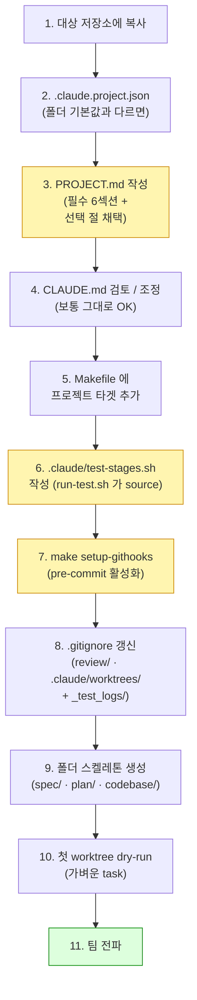

# Claude Code Harness — 가이드

> 본 저장소는 **Claude Code 하네스 템플릿** 입니다. 
> SDD + TDD + AI Review 자동화 + 다중 PR 통합까지 한 세트로 묶여 있어, 
> README 의 단계만 따라하면 어느 저장소에서도 활용할 수 있습니다.
>
> 하네스 전체 구조와 강점/약점은 [`OVERVIEW.md`](OVERVIEW.md)을 참고하세요.

> 주 목적은 규모 있는 프로젝트에서도 안정적이고 지속적인 개발이 가능하도록 하는 것입니다.
> 따라서 상당히 많은 가드가 추가되어 있으며, 토큰 소모량이 높습니다.
> 잘못된 구현의 반복보다 한번의 비용은 높지만 반복을 줄이는 것이 최종 비용이 더 낮다는 관점에서 작성되었습니다.

---

## 1. 무엇이 들어있나

```
./                                    # 하네스 저장소 루트 (본 repo 자체가 템플릿)
├── .claude/                          # 하네스 본체 (모두 그대로 복사)
│   ├── agents/                       # 28 sub-agents (13 reviewer + router + summary +
│   │                                 #                5 checker + checker summary +
│   │                                 #                4 analyzer + analyzer summary + resolver +
│   │                                 #                resolution-applier 자동 fix sub-agent)
│   ├── commands/                     # /ai-review · /consistency-check · /merge-coordinate
│   ├── docs/                         # 공유 SSOT 문서 (lazy load — 호출 시에만 Read)
│   │   ├── worktree-policy.md        #   Worktree 정책 + Enforcement 4-layer 상세
│   │   ├── plan-lifecycle.md         #   plan/in-progress ↔ complete 라이프사이클
│   │   ├── subagent-call-contract.md #   모든 sub-agent 의 공통 호출 규약·STATUS·재시도
│   │   └── test-wrapper.md           #   .claude/tools/run-test.sh 사용법
│   ├── hooks/                        # default branch 편집 차단 + bash·prompt 리마인더
│   │   ├── _lib/branch_guard.py      #   3 hook 이 공유하는 단일 판정 모듈
│   │   ├── guard_default_branch_edit.py    # PreToolUse (Write/Edit/MultiEdit/NotebookEdit) — 차단
│   │   ├── guard_default_branch_bash.py    # PreToolUse (Bash, mutating) — 세션당 1회 리마인더
│   │   └── guard_default_branch_prompt.py  # UserPromptSubmit — 작업성 키워드 매칭 시 리마인더
│   ├── skills/                       # 5개 핵심 skill + _lib
│   │   ├── _lib/                     #   공유 라이브러리 (project_config.py)
│   │   ├── developer/                #   구현/TDD 워크플로
│   │   ├── project-planner/          #   기획/Spec 워크플로
│   │   ├── consistency-checker/      #   사전 일관성 검토 (5 checker 병렬)
│   │   ├── code-review-agents/       #   사후 코드 리뷰 (13 reviewer + router + summary
│   │   │                             #                  + resolution-applier 자동 후속)
│   │   └── merge-coordinator/        #   다중 PR 통합 (4 analyzer + summary + resolver)
│   ├── tools/
│   │   ├── ensure-worktree.sh        #   canonical worktree 생성 헬퍼
│   │   └── run-test.sh               #   TEST WORKFLOW stage 출력 truncation wrapper
│   ├── test-stages.sh.example        # 프로젝트가 cp 후 cmd_lint/unit/build/e2e 함수 채움
│   ├── settings.json                 # PreToolUse (Write/Edit/Bash) + UserPromptSubmit hook 등록
│   ├── statusline.sh                 # 터미널 상태줄 (선택)
│   └── README.md                     # 하네스 자체 안내
├── .githooks/
│   └── pre-commit                    # git commit 단계 default branch 차단 (4-layer 중 C)
├── scripts/
│   └── setup-githooks.sh             # core.hooksPath 등록 (clone 후 1회)
├── CLAUDE.md                         # 공통 규약 (78줄. 상세는 .claude/docs/ 참고)
├── PROJECT.md                        # 프로젝트별 매핑 (채택 시 작성 필수)
├── .claude.project.json              # 폴더 경로 매핑 (기본값과 같으면 생략 가능)
├── Makefile                          # setup-githooks 타겟 (프로젝트 타겟은 채택 시 추가)
├── OVERVIEW.md                       # 하네스 전체 구조 + 강점/약점 + 라이프사이클
└── README.md                         # 본 문서
```

### 제외된 항목 (의도적)

- `.claude/settings.local.json` — 사용자별 로컬 override (committed 하지 않음).
- `.claude/test-stages.sh` — 프로젝트가 채택 시 example 에서 cp 후 자기 명령으로 채움 (committed 함, 단 .example 만 본 템플릿에 포함).

---

## 2. 사전 요구사항 (Prerequisites)

| 항목 | 최소 버전 | 확인 명령 |
|------|-----------|-----------|
| git | 2.30+ (worktree 정상 동작) | `git --version` |
| python3 | 3.8+ (hooks · orchestrator) | `python3 --version` |
| Claude Code CLI | 최신 | `claude --version` |
| bash | 4+ (또는 zsh) | `bash --version` |

> Anthropic 키는 Claude Code CLI 설치 시 설정. 본 하네스는 모든 model 호출을 **main session 안의 Agent tool** 로만 진행하므로 추가 SDK 설치 불필요 (`claude -p`, Anthropic SDK 직접 호출은 정책상 금지).

---

## 3. 초기 세팅 — 11단계



### 단계 1 — 대상 저장소에 복사

본 저장소가 곧 템플릿이다. `<harness-repo>` 는 본 저장소를 clone 한 로컬 경로.

```bash
# A. 본 템플릿을 target repo 루트에 통째로 복사
cd <target-repo-root>

# (1) 하네스 본체
cp -R <harness-repo>/.claude          .
cp -R <harness-repo>/.githooks        .
cp -R <harness-repo>/scripts          .

# (2) 정책·매핑 문서
cp <harness-repo>/CLAUDE.md                .
cp <harness-repo>/PROJECT.md               .
cp <harness-repo>/.claude.project.json     .   # 필요시 (단계 2 참고)

# (3) Makefile — 기존 Makefile 이 있으면 setup-githooks 타겟만 추가 (단계 5)
#    없으면 그대로 복사
cp <harness-repo>/Makefile             .   # 또는 통합
```

> **B. 이미 git repo 라면** `git add` 전에 단계 2-8 까지 마치고 한 PR (`chore(harness): adopt Claude Code harness`) 로 묶어 올린다.

### 단계 2 — `.claude.project.json` 작성 (선택)

폴더 배치가 하네스 기본값과 동일하면 **본 파일은 생략 가능**. 기본값:

| 키 | 기본값 | 의미 |
|----|--------|------|
| `corpora.spec` | `spec` | 제품 spec SSOT 루트 |
| `corpora.conventions` | `spec/conventions` | 정식 규약 폴더 |
| `corpora.plan_in_progress` | `plan/in-progress` | 진행 중 plan |
| `corpora.plan_complete` | `plan/complete` | 완료 plan |
| `outputs.review_code` | `review/code` | `/ai-review` 세션 디렉토리 부모 |
| `outputs.review_consistency` | `review/consistency` | `/consistency-check` 부모 |
| `outputs.review_merge` | `review/merge` | `/merge-coordinate` 부모 |
| `code_areas` | `["codebase"]` | 코드베이스 루트 (배열 — 멀티 가능) |

비표준 배치의 예:

```jsonc
{
  "corpora": {
    "spec": "docs/spec",
    "plan_in_progress": "tracking/in-progress",
    "plan_complete":    "tracking/complete"
  },
  "code_areas": ["services/api", "services/worker", "packages"]
}
```

> **개념(concept) 자체는 변경 불가**. spec corpus / plan tracking / review outputs / code areas 라는 개념은 하네스 계약의 일부 (CLAUDE.md "폴더 구조" 참고). 폴더 위치만 옮길 수 있다.

### 단계 3 — `PROJECT.md` 작성 (필수)

가장 비중이 큰 단계. **모든 placeholder (`<...>`) 를 실제 값으로 치환**. 

> 직접 작성이 부담될 경우, 해당 단계를 맨 뒤로 미루고 `claude`에게 요청해서 갱신할 수 있습니다. (특히, 기존 프로젝트에 도입시 유용합니다.)

#### 필수 섹션 (모든 프로젝트)

| § | 섹션 | 누가 읽는가 | 누락 시 영향 |
|---|------|-------------|------------|
| 1 | 코드베이스 구조 | Main Claude — 영향 범위 추정 | 추정 부정확 |
| 2 | 빌드·린트·테스트 명령 | TEST WORKFLOW 4단계 (`.claude/tools/run-test.sh` wrapper) | 자동 흐름 정지 |
| 3 | e2e 면제 화이트리스트 | 자동 e2e 의무 실행 흐름 | 모든 변경에 e2e 강제 |
| 4 | 변경 유형 → 갱신 위치 매핑 | developer SKILL.md §4 | i18n·docs 누락 |
| 5 | e2e 테스트 작성 가이드 | developer | 패턴 부재 |
| 6 | 도메인 어휘 | 모든 sub-agent | 짧은 prompt 에서 맥락 손실 |

#### 함께 포함된 방법론 절 (템플릿에 baked-in — 인프라명·실측 사례만 채움)

| 절 | 역할 |
|----|------|
| e2e 실행 원칙 (회피 안티패턴 · 사전 체크리스트 · 자주 누락 turn 패턴) | TEST WORKFLOW e2e 단계가 회피되지 않도록 자가 점검 |
| 사후 보정 PR 패턴 금지 — 같은 turn 원칙 + DOCUMENTATION 단계 종료 체크리스트 | `fix(i18n):` · `fix(docs):` 별 commit 패턴 차단 |
| Cross-stack 의무 (빌드 명령 표 직후 단락) | 멀티-stack 프로젝트가 wrapper 통해 양쪽 stack 묶음으로 호출하도록 |
| Worktree 별 e2e 자동 격리 (선택 — 강력 권장) | 여러 worktree 동시 e2e 충돌 방지 |

#### 선택 절 (프로젝트 사정에 따라 채택·삭제)

| 절 | 채택 조건 |
|----|----------|
| 유저 가이드 파일 컨벤션 (SoT 문서 인덱스 + 자가 검증 체크리스트) | in-repo 사용자 가이드/문서를 유지하고 `user-guide-writer` sub-agent 로 위임할 때 |
| i18n dict 파일 컨벤션 | i18n dict 를 단일 거대 파일이 아닌 섹션별로 split 할 때 |
| 자동 가드 (build-time 차단) 목록 | 결정적 단위 테스트로 누락 검출을 빌드 단계에서 차단할 때 (i18n parity·spec frontmatter 등) |
| 알려진 backend/frontend quirk · 우회 | e2e 헬퍼가 풀어주는 인증/세션/throttle 문제 등이 있을 때 |

PROJECT.md 끝의 **작성 체크리스트** (12개 항목) 를 모두 `[x]` 처리 후 안내 문구를 삭제.

### 단계 4 — `CLAUDE.md` 검토

공통 규약 (worktree 정책 · skill 체계 · 외부 LLM 호출 금지 등) 의 핵심 SSOT. 78줄로 압축되어 있고, 상세 운영 규칙은 `.claude/docs/` 하위에 분리되어 있습니다. **보통 그대로 사용**. 본 저장소만의 특수 사정이 있으면 다음만 조정:

- "## 폴더 구조" — `.claude.project.json` 의 `code_areas` 와 일관성 맞춤
- "## 패키지 매니저" — npm / yarn / pnpm 중 채택한 것으로 통일
- "## 외부 LLM 호출 정책" — 변경 금지 (요금제 정책)

`.claude/docs/` 하위 4개 doc 도 같이 복사된다 — 별도 조정 보통 불필요.

### 단계 5 — Makefile 에 프로젝트 타겟 추가

본 템플릿의 `Makefile` 에는 `setup-githooks` 만 있음. 프로젝트별 build·lint·test·e2e 타겟을 추가:

```makefile
# 본 템플릿 Makefile 의 주석 처리된 예시 참고
build:
	cd codebase/backend && npm run build
	cd codebase/frontend && npm run build

lint:
	cd codebase/backend && npm run lint
	cd codebase/frontend && npm run lint

test:
	cd codebase/backend && npm test
	cd codebase/frontend && npm test

e2e-test:
	docker compose -f docker-compose.e2e.yml up --build --abort-on-container-exit
```

**Worktree 별 e2e 자동 격리** 패턴 (강력 권장): docker compose project name 을 worktree dir basename 으로 도출하면 여러 worktree 가 e2e 를 동시에 돌려도 충돌 없음.

### 단계 6 — `.claude/test-stages.sh` 작성

`.claude/tools/run-test.sh` 가 TEST WORKFLOW 의 lint / unit / build / e2e 4단계 출력을 truncate 하기 위해 source 하는 파일. 통과 시 stdout 한 줄 (≤100 토큰), 실패 시 한 줄 + 마지막 30줄 + 실패 마커 grep (≤2K 토큰). 전체 로그는 디스크 (`_test_logs/<stage>-<ts>.log`) 보존.

```bash
cp .claude/test-stages.sh.example .claude/test-stages.sh
$EDITOR .claude/test-stages.sh
```

채워야 할 함수 4개:

```bash
cmd_lint()  { cd codebase/backend && npm run lint; }
cmd_unit()  { cd codebase/backend && npm test; }
cmd_build() { cd codebase/backend && npm run build; }
cmd_e2e()   { make e2e-test; }
```

상세: [`.claude/docs/test-wrapper.md`](.claude/docs/test-wrapper.md).

### 단계 7 — git hook 활성화

```bash
make setup-githooks
# → core.hooksPath set to '.githooks'.
```

확인:
```bash
git config --get core.hooksPath
# .githooks
```

> `core.hooksPath` 는 **per-clone 설정** (git 전체 sync 대상 아님) — 모든 contributor 가 clone 후 1회 실행해야 한다. CI 에서는 불필요 (CI 에는 commit 단계 없음).

### 단계 8 — `.gitignore` 갱신

다음 경로들을 추가:

```gitignore
# Claude Code worktrees — 일시 작업 공간
.claude/worktrees/

# 사용자별 settings (선택 — 팀 공유 안 하려면)
.claude/settings.local.json

# 테스트 출력 wrapper 의 로그 (디스크 보존, 누적 정리 필요)
_test_logs/
```

> `review/code/`, `review/consistency/`, `review/merge/` 는 기본적으로 **commit 대상** — 감사 흔적이며, 프로젝트 성격에 따라 추가하세요.

### 단계 9 — 폴더 스켈레톤 생성

```bash
mkdir -p spec/conventions
mkdir -p plan/in-progress plan/complete
mkdir -p review/code review/consistency review/merge
mkdir -p codebase  # 또는 .claude.project.json 의 code_areas
```

각 폴더에 `.gitkeep` 또는 짧은 `README.md` 를 두어 git 이 인식하게 함:

```bash
echo "# spec/ — 제품의 단일 진실 (CLAUDE.md 참고)" > spec/README.md
echo "# plan/in-progress/ — 진행 중 plan" > plan/in-progress/README.md
echo "# plan/complete/ — 완료 plan" > plan/complete/README.md
```

### 단계 10 — 첫 worktree dry-run

세팅이 끝났는지 가벼운 task 로 확인:

```bash
# (a) 별 worktree 신설 (canonical 헬퍼)
.claude/tools/ensure-worktree.sh harness-smoke-test
cd .claude/worktrees/harness-smoke-test-*

# (b) 의도적으로 main 워크트리에서 편집 시도 → 차단되는지 확인
cd <repo-root>
echo "test" >> README.md   # 직접 편집은 안 막힘 (Claude Code 의 Write 만 막힘)
# Claude Code 에서 Write/Edit 시도 → "BLOCKED by guard_default_branch_edit.py" 표시되면 OK

# (c) worktree 로 돌아가 가벼운 task 진행
cd .claude/worktrees/harness-smoke-test-*
# Claude Code 안에서: /ai-review (변경 없으면 minimal SUMMARY 종료)

# (d) test wrapper 확인
.claude/tools/run-test.sh lint  # PASS 시 한 줄. _test_logs/ 에 로그 보존
```

확인 포인트:
- [ ] main 워크트리에서 Write/Edit 호출이 차단됨
- [ ] `git commit` (main 워크트리, default branch) 차단됨
- [ ] `.claude/worktrees/*` 에서는 정상 동작
- [ ] `/ai-review` 가 `review/code/<YYYY>/<MM>/<DD>/<hh>_<mm>_<ss>/` 디렉토리 생성
- [ ] `.claude/tools/run-test.sh lint` 가 stdout 한 줄 + 로그파일 생성

### 단계 11 — 팀 전파

- README + CLAUDE.md + PROJECT.md + `.claude/docs/` 를 PR 로 올림 (제목 예: `chore(harness): adopt Claude Code harness`).
- 채택 후 첫 주는 페어로 작업 — 새 패턴 (worktree, `/ai-review` 자동 흐름, `/consistency-check` BLOCK) 에 익숙해질 때까지.
- 공유 자료: [`OVERVIEW.md`](OVERVIEW.md) (강점/약점 + 라이프사이클 다이어그램).

---

## 4. 일상 사용 흐름 (한 장 요약)

claude code에 작업을 요청하면, 내부적으로 아래의 흐름으로 동작합니다.

```bash
# 1. 작업 시작 — 항상 worktree (canonical 헬퍼)
.claude/tools/ensure-worktree.sh <task_name>
# 출력 마지막 줄의 `cd ...` 를 그대로 실행
cd .claude/worktrees/<task_name>-<slug>

# (또는 native: git worktree add .claude/worktrees/<task>-<slug> -b claude/<task>-<slug>)

# 2. Spec 변경이 필요하면 → project-planner skill
#    spec/ 쓰기 직전 /consistency-check --spec 자동 호출

# 3. 구현 → developer skill
#    구현 착수 직전 /consistency-check --impl-prep 자동 호출
#    TDD: 테스트 선작성 → 구현 → 보강
#    TEST WORKFLOW: lint → unit → build → e2e (각 단계 자동 commit)
#    각 단계는 .claude/tools/run-test.sh <stage> 로 호출 → 출력 truncation

# 4. 사후 리뷰
/ai-review                                 # 13 reviewer 병렬 (router 선별)
# 자동 후속: resolution-applier sub-agent 가 분류·fix·e2e·RESOLUTION 자동 처리
# (ESCALATE flag 가 spec / user-decision / infra / e2e-fail-3x / sensitive-fix 면
#  main 으로 escalate — 사용자 결정 필요한 순간만 돌아옴)

# 5. 한도 걸리면 무한 재시도
/loop /ai-review                           # ScheduleWakeup 으로 자동 재시도

# 6. PR 생성 (사용자가 명시 요청 시만)
gh pr create ...

# 7. 다중 PR 통합
/merge-coordinate <PR#> <PR#>              # 4 analyzer → 격리 worktree → /ai-review 자동 chain

# 8. worktree 정리
cd <repo-root>
git worktree remove .claude/worktrees/<task>-<slug>
```

---

## 5. Troubleshooting

### "BLOCKED by guard_default_branch_edit.py"

- **원인**: main 워크트리 (default branch) 에서 Write/Edit 시도.
- **해결**: `.claude/worktrees/<task>-<slug>/` 에서 작업하거나, 정당한 이유가 있으면 `BYPASS_DEFAULT_BRANCH_GUARD=1` 환경변수.

### `make setup-githooks` 실행 후에도 commit 이 차단되지 않음

- **확인**: `git config --get core.hooksPath` → `.githooks` 가 출력되어야 함.
- **체크**: `.githooks/pre-commit` 실행권한 (`ls -l .githooks/pre-commit` → `x` 비트). 없으면 `chmod +x .githooks/pre-commit`.

### `/ai-review` 실행 시 "module not found"

- **확인**: `.claude/skills/_lib/` 가 복사되어 있는지. orchestrator 들이 모두 `_lib.session`, `_lib.project_config` 를 import 함.
- **체크**: `ls .claude/skills/_lib/project_config.py`

### `consistency-check` 가 spec 영역을 못 찾는다

- **원인**: `.claude.project.json` 의 `corpora.spec` 와 실제 폴더 불일치.
- **해결**: 둘 중 하나로 통일. 보통 `.claude.project.json` 의 값을 실제 폴더에 맞춤.

### sub-agent 가 즉시 `STATUS=fatal` 로 끝남

- **원인**: `.claude/agents/<name>.md` definition 부재, prompt 파일 부재, 또는 `output_file` 경로 쓰기 권한 없음.
- **확인**: `review/<…>/_prompts/<name>.md` 가 생성되었는지, `_retry_state.json` 의 `subagent_invocations` 와 일치하는지.

### `.claude/tools/run-test.sh` 가 "CONFIG_MISSING" 출력

- **원인**: `.claude/test-stages.sh` 파일이 없음.
- **해결**: `cp .claude/test-stages.sh.example .claude/test-stages.sh` 후 `cmd_lint` · `cmd_unit` · `cmd_build` · `cmd_e2e` 4개 함수를 프로젝트 명령으로 채움.

### Claude Code 가 worktree 안내만 띄우고 동작 안 함

- **원인**: UserPromptSubmit hook (`guard_default_branch_prompt.py`) · Bash 리마인더 (`guard_default_branch_bash.py`) 는 차단이 아닌 안내. 실제 차단은 Write/Edit 시점 (`guard_default_branch_edit.py`) 와 `git commit` 시점 (`.githooks/pre-commit`) 두 곳.
- **해결**: 안내대로 worktree 생성 후 작업 진행. `.claude/tools/ensure-worktree.sh <task_name>` 한 줄로 생성, 출력 마지막 줄 `cd ...` 를 따라 진입.

### Sub-agent 들이 모두 rate_limit 으로 떨어짐

- **원인**: 1시간 / 5시간 한도 도달.
- **해결**: `/loop /ai-review` 로 진입하면 `ScheduleWakeup` 이 한도 회복 시점에 자동 재시도. main session 점유 안 함.

### `/ai-review` 자동 후속 흐름이 잘못 자동 수정함

- **원인**: resolution-applier sub-agent 가 민감 변경(DB 마이그레이션, 외부 API 계약 등)을 자동 수정하지 않아야 하는데 진행한 경우.
- **해결**: SUMMARY.md 의 해당 항목에 "사용자 결정 필요" 명시 또는 화이트리스트 확대 (`PROJECT.md §변경 유형 매핑`). resolution-applier 의 ESCALATE 매트릭스가 `sensitive-fix` 로 escalate 해야 정상.

---

## 6. 다음 단계 — 깊이 있는 학습

| 주제 | 문서 |
|------|------|
| 하네스 전체 구조 / 강점·약점 | [`OVERVIEW.md`](OVERVIEW.md) |
| 공통 규약 (짧은 SSOT) | `CLAUDE.md` |
| Worktree 정책 상세 | `.claude/docs/worktree-policy.md` |
| Plan 라이프사이클 | `.claude/docs/plan-lifecycle.md` |
| Sub-agent 호출 규약 (공통) | `.claude/docs/subagent-call-contract.md` |
| Test wrapper 사용법 | `.claude/docs/test-wrapper.md` |
| 기획자 워크플로 | `.claude/skills/project-planner/SKILL.md` |
| 개발자 워크플로 (TDD + TEST WORKFLOW) | `.claude/skills/developer/SKILL.md` |
| 사전 검토 | `.claude/skills/consistency-checker/SKILL.md` |
| 사후 리뷰 (자동 후속 흐름) | `.claude/skills/code-review-agents/SKILL.md` |
| 다중 통합 | `.claude/skills/merge-coordinator/SKILL.md` |
| Sub-agent 정의 (28종) | `.claude/agents/*.md` |
| Slash command 진입점 | `.claude/commands/*.md` |
| Python orchestrator 내부 | `.claude/skills/_lib/`, `.claude/skills/*/scripts/` |

---

## 7. 라이선스 · 기여

본 하네스는 Clemvion 프로젝트에서 추출한 generic skeleton 입니다.<br/>
MIT 라이센스이며, 자유롭게 수정 및 재배포가 가능합니다.<br/>
개선을 위한 아이디어가 있다면 PR 부탁드립니다.
