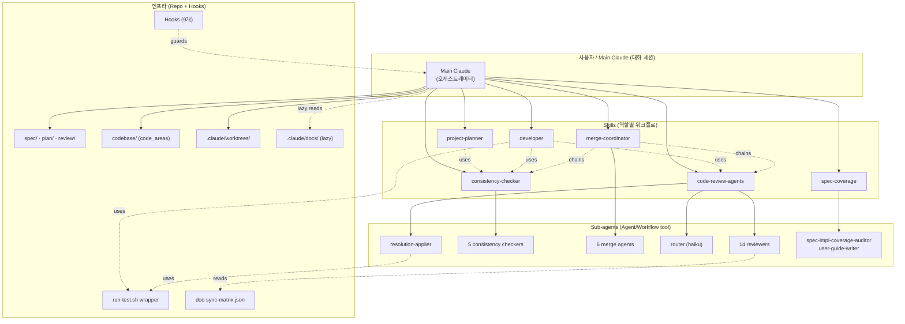
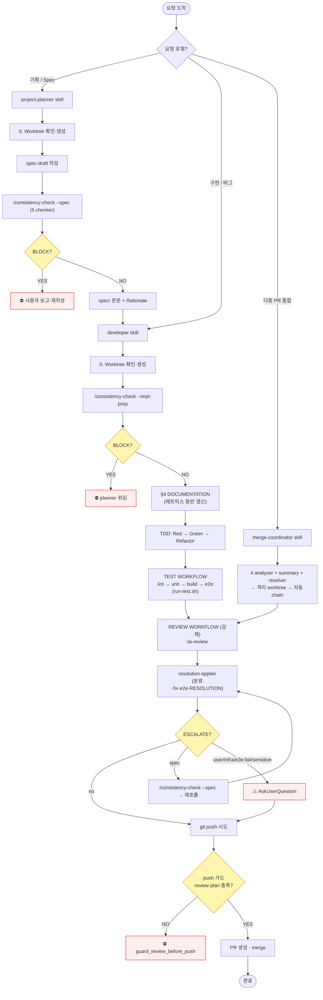
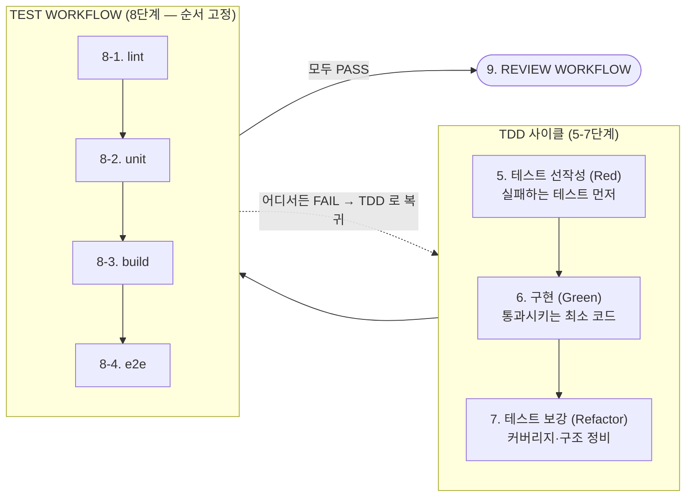
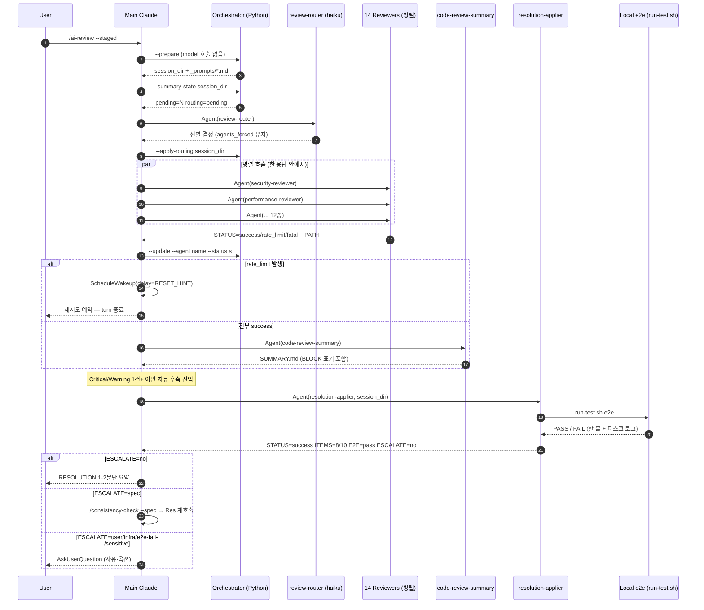
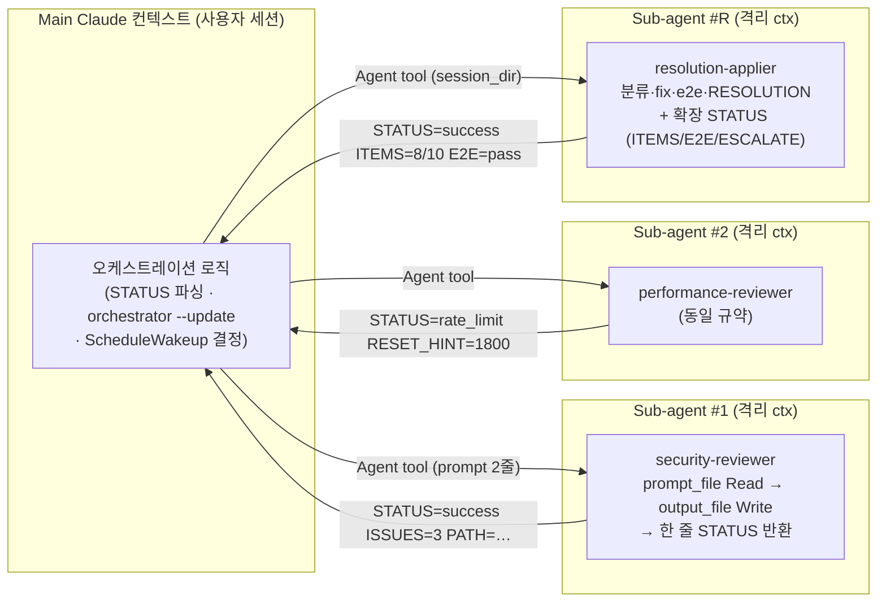
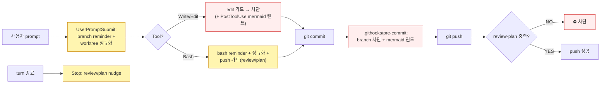
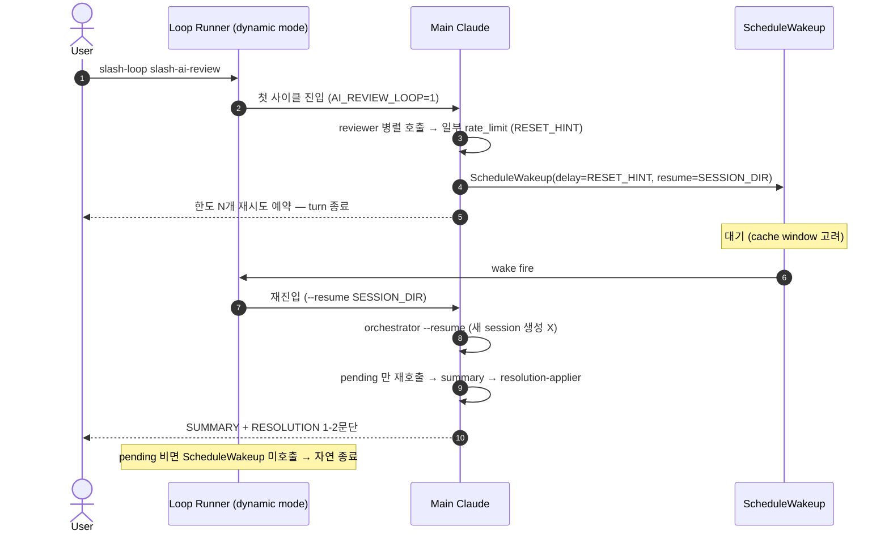
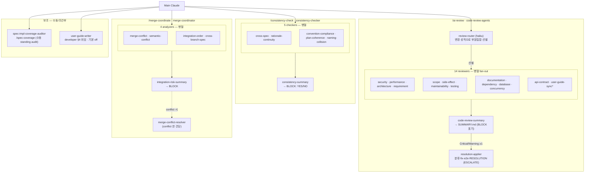

# 하네스(Harness)의 구조 (v2)

> 본 문서는 **해당 하네스의 구조를 이해하기 위한 자료**입니다. 프로젝트 본체의 `CLAUDE.md` / `PROJECT.md` / `.claude/skills/**` / `.claude/docs/**` 가 SSOT(Single Source of Truth)입니다 — 본 문서와 어긋나면 그쪽이 정답입니다.
>
> v2 는 clemvion 프로젝트 하네스의 *현재 상태* 를 증류한 버전으로, v1 대비 **review/plan push·stop 가드, worktree 브랜치 자동 정규화, mermaid 린트, SessionStart 부트스트랩, 네이티브 `Workflow` tool 경로, 하네스 self-test 스위트, 변경-유형 매트릭스의 machine-readable SSOT, reviewer/checker/writer 토글** 이 추가되었습니다.

---

## 1. 한 줄 요약

> **"기획(Spec) → 사전 일관성 검토 → 구현(TDD) → AI 코드 리뷰 → 자동 Fix(격리 sub-agent) → e2e → PR → 다중 통합"** 전 라이프사이클을 **격리된 sub-agent + worktree + 무한 재시도 큐(/loop + ScheduleWakeup) + 다층 자동 차단 가드** 위에 올린 Claude Code 전용 자동화 골격.

핵심은 네 가지입니다.

1. **역할 격리**: Main Claude 가 직접 모든 일을 하지 않고, 좁은 책임의 **sub-agent 들**을 `Agent` tool (또는 `Workflow` tool) 로 invoke 해서 병렬·격리 컨텍스트에서 처리합니다. Main 은 한 줄 STATUS 만 보고, 긴 분석·로그는 sub-agent 의 격리 윈도우와 디스크 파일에 남습니다.
2. **사전·사후 게이트(BLOCK)**: spec 이 디스크에 박히기 **전**(`/consistency-check --spec`), 구현이 시작되기 **전**(`--impl-prep`), 코드가 PR 로 나가기(`git push`) **전**(review/plan 가드) — 단계마다 자동 검토를 끼워서 잘못된 상태를 멈추게 합니다. "수정 후 검토" 가 아니라 "검토 후 수정".
3. **Main ctx 보호**: AI Review 의 자동 후속 흐름(fix / e2e / RESOLUTION) 도 `resolution-applier` sub-agent 가 격리 컨텍스트에서 담당. main 으로 돌아오는 건 한 줄 STATUS + ESCALATE flag 뿐 — 사용자 결정이 필요한 순간만 main 으로 올라옵니다.
4. **모델 자율 준수에 의존하지 않음**: worktree·review·plan 규칙을 prose 가 아닌 **hook** 으로 강제합니다 — 잊거나 미루면 편집·commit·push·turn-종료 시점에 자동으로 막거나(차단) 안내(reminder)합니다. 차단은 의식적 `BYPASS_*` 로만 우회됩니다.

---

## 2. 구성 요소 한눈에 보기

| 계층 | 구성 요소 | 역할 |
| --- | --- | --- |
| **정책 문서** | `CLAUDE.md`, `PROJECT.md` | 모든 역할이 따라야 하는 공통 규약 SSOT · 프로젝트별 매핑 |
| **공유 docs** | `.claude/docs/{worktree-policy, plan-lifecycle, subagent-call-contract, test-wrapper, orchestrator-workflow-migration}.md` + `README.md` | 호출 시에만 lazy load 되는 상세 운영 규칙. CLAUDE.md / SKILL.md / agent definition 이 한 줄 링크로 인용 |
| **Skills** | `.claude/skills/<name>/SKILL.md` (6종) | 역할별 워크플로 (planner / developer / consistency-checker / code-review-agents / merge-coordinator / spec-coverage) |
| **Sub-agents** | `.claude/agents/*.md` (31종) | 좁은 책임의 검토·실행 인격. 격리 컨텍스트에서 `Agent`/`Workflow` tool 로만 invoke |
| **Slash commands** | `/ai-review`, `/consistency-check`, `/merge-coordinate`, `/spec-coverage` | Skill 진입점 |
| **Orchestrators (Python)** | `.claude/skills/<name>/scripts/*_orchestrator.py` | **model 호출 없이** 세션 디렉토리 · 에이전트별 prompt 파일 · `_retry_state.json` 생성. `--summary-state`/`--update`/`--apply-routing`/`--resume` 로 main 이 JSON 을 직접 Read 하지 않게 echo |
| **Workflows (JS)** | `.claude/workflows/{ai-review, consistency-check, merge-coordinate}.js` | 네이티브 `Workflow` tool 스크립트 — route/fan-out/summary 의 결정적 오케스트레이션 (plan-metered) |
| **변경-유형 SSOT** | `.claude/config/doc-sync-matrix.json` | PROJECT.md "변경 유형 → 갱신 위치 매핑" 표의 machine-readable 짝. `user-guide-sync-reviewer` 가 소비, `test_doc_sync_matrix.py` 가 행 수 1:1 검증 |
| **Tools** | `.claude/tools/{ensure-worktree, run-test, bootstrap-session, cleanup-worktree, reap-merged-worktrees, plan-stale-audit}.sh`, `mermaid-lint/` | worktree 생성·정리·회수 · TEST stage 출력 truncation · 세션 부트스트랩 · stale plan 검출 · mermaid 파서 |
| **Hooks** | `.claude/hooks/`, `.githooks/pre-commit` | default-branch 편집·commit 차단, push 전 review/plan 차단, turn-종료 nudge, 브랜치 정규화, mermaid 린트, prompt/bash 리마인더, resolution-applier in-flight 마커(중복 재리뷰 억제) |
| **Self-tests** | `.claude/tests/*.py` (표준 라이브러리만) | 하네스 자체 Python(가드·정규화·레지스트리·orchestrator·매트릭스)의 회귀 안전망 |
| **Worktrees** | `.claude/worktrees/<task>-<slug>/` | 작업별 격리. main 워크트리는 통합/릴리스 전용 |
| **세션 산출물** | `review/{code,consistency,merge,spec-coverage}/<YYYY>/<MM>/<DD>/<hh>_<mm>_<ss>/` | 모든 검토 흔적. `SUMMARY.md` + 에이전트별 결과 + `_retry_state.json` (+ ai-review `RESOLUTION.md`) |
| **런타임 state** | `.claude/state/` (gitignore) | 가드의 once-per-session 마커 (bootstrap 이 30일 GC) |
| **테스트 로그** | `_test_logs/<stage>-<ts>.log` (gitignore) | run-test.sh 가 떨어뜨림. main ctx 안 거치고 디스크 보존만 |



---

## 3. 전체 라이프사이클 — Planning 부터 PR 까지

요청이 도착하면 유형에 따라 세 skill 중 하나로 분기하고, 각 단계마다 자동 게이트(노란 마름모)와 차단(빨강)이 끼어듭니다. 마지막 `git push` 직전 review/plan 가드가 한 번 더 막습니다.



### 3.1 TDD + TEST WORKFLOW 상세

구현(5–8단계)을 떼어 본 흐름. TDD 사이클로 코드를 만들고, 고정 순서의 TEST WORKFLOW 로 검증합니다. **어느 단계에서 실패하든 가장 가까운 수정 단계(TDD)로 되돌아가** 1단계부터 다시 돕니다.



**순서 근거 (왜 lint → unit → build → e2e 인가)**: 싼 피드백을 앞에 두어 비싼 단계의 낭비를 막는다.

| 단계 | 소요 | 실패 비용 | 의도 |
| --- | --- | --- | --- |
| lint | ~수 초 | 0 | 가장 싼 피드백 먼저. 포맷·import·simple 오류 즉시 컷 |
| unit | 수십 초 | 0 | in-process. 인프라 없이 빠른 회귀 확인 |
| build | 수십 초~분 | 중 | 타입 오류 + bundler dead import 검출. **e2e 의 docker 빌드 비용(분 단위) 낭비 방지** |
| e2e | 분 단위 | 큼 | docker compose 위 multi-actor · 실 인프라 회귀 |

각 단계는 `.claude/tools/run-test.sh <stage>` wrapper 로 호출 — 통과 시 stdout 한 줄(≤100 토큰), 실패 시 한 줄 + 마지막 30줄 + 실패 마커 grep(≤2K 토큰). 전체 로그는 `_test_logs/<stage>-<ts>.log` 디스크 보존. raw 명령 직접 호출은 main ctx 폭주 위험으로 금지. 멀티-stack 프로젝트는 wrapper 가 한 단계에서 양쪽 stack 을 묶어 호출하는 것이 invariant 의 유일한 enforcer.

### 3.2 단계별 자동 커밋 매핑

각 단계가 atomic commit 으로 분리되어 사후 bisect / revert 가 항상 가능합니다.

| 워크플로 단계 | commit 시점 | message prefix |
| --- | --- | --- |
| 4. DOCUMENTATION | 문서·번역·schema 동반 갱신 + lint 통과 직후 | `docs(<scope>):` |
| 5-7. TDD 묶음 | 단위 테스트 통과 직후 | `feat`/`fix`/`refactor(<scope>):` |
| 8. TEST WORKFLOW | 4단계 모두 통과 + **이 단계에서 수정 발생 시만** | `test(<scope>):` / `style(<scope>):` |
| 9. REVIEW (ai-review 자동 후속 포함) | 이슈 조치 + RESOLUTION.md + TEST WORKFLOW 재통과까지 **단일 commit** | `refactor(<scope>):` 또는 `docs(review):` |
| 10. plan complete | PR 의 모든 체크박스 `[x]` + follow-up 0건일 때만 | `chore(plan): mark <name> complete` |

> **`--amend` 금지 · `git add -A` 금지 · pre-commit hook `--no-verify` 금지**. 자동 fix commit 메시지에는 `SUMMARY#<n>` 인용을 강제해 SUMMARY 항목 ↔ commit 매핑을 git log 만으로 추적할 수 있게 합니다.

### 3.3 단계별 산출물 요약

| 단계 | 살아있는 산출물 | 시점 산출물 (감사 흔적) |
| --- | --- | --- |
| 기획 | `spec/<영역>/*.md` (Overview · 본문 · Rationale 3섹션) | `review/consistency/<…>/SUMMARY.md` |
| 구현 | `codebase/**`, `plan/in-progress/<task>.md` | (단계별 자동 commit) |
| 사전 검토 | (없음 — 차단만) | `review/consistency/<…>/{SUMMARY.md, <checker>.md}` |
| 사후 리뷰 | `review/code/<…>/RESOLUTION.md` | `review/code/<…>/{SUMMARY.md, <role>.md, _routing_decision.json, _resolution_state.json, _resolution_log.md}` |
| 다중 통합 | `.claude/worktrees/integrate-<slug>/` | `review/merge/<…>/{SUMMARY.md, <analyzer>.md, _conflicts/*.{md,patch}}` |
| Plan 종료 | `plan/complete/<name>.md` (git mv) | — |

---

## 4. AI Review 자동 후속 흐름 (Sequence)

`/ai-review` 는 단순한 "조언" 이 아니라, **수정 → e2e → RESOLUTION 까지 자동으로 끝내는** 닫힌 루프입니다. 자동 후속 처리는 `resolution-applier` sub-agent 가 격리 컨텍스트에서 담당 — main 으로 돌아오는 건 한 줄 STATUS + ESCALATE flag 뿐.



### 핵심 안전 가드 — resolution-applier 의 ESCALATE 매트릭스

자동 진행을 **중단하고 main 으로 escalate** 하는 사유:

| ESCALATE | 조건 | main 의 후속 |
| --- | --- | --- |
| `no` | 모든 항목 처리 + e2e 통과 + spec 변경 0건 | 사용자 1-2문장 보고 + 종료 |
| `spec` | spec 관련 항목 있음 — draft 만 작성 후 main 으로 위임 | `/consistency-check --spec` 자동 chain → BLOCK:NO 시 반영 → Res 재호출 |
| `user-decision` | SUMMARY 가 "사용자 결정 필요" 명시 | AskUserQuestion |
| `infra` | docker daemon 미동작, 디스크 부족 등 환경 차단 | AskUserQuestion + 환경 복구 안내 |
| `e2e-fail-3x` | e2e 3회 연속 실패 | AskUserQuestion + 부분 RESOLUTION |
| `sensitive-fix` | DB 마이그레이션·외부 API 계약·인증 흐름 등 위험한 자동 수정 | AskUserQuestion + 변경 사항 표시 |

**원칙**: 의심 시 ESCALATE=yes 가 default — 자동 진행이 위험할 때 sub-agent 가 마음대로 진행하지 않는다.

**idempotency 보장**: resolution-applier 가 중간 종료돼도 `_resolution_state.json` + git log(commit 메시지의 `SUMMARY#<n>` 인용) + RESOLUTION.md 로 복구. main 은 같은 session_dir 로 재호출만 하면 처리된 항목을 자동 skip 합니다.

---

## 5. Sub-agent 격리 모델



**왜 이렇게 설계했는가?**

1. **Main 컨텍스트 보호**: reviewer 14개의 분석 + resolution-applier 의 fix·e2e 로그가 main 의 토큰 윈도우에 쌓이지 않습니다 (Main 은 한 줄 STATUS 만 봅니다). 긴 세션에서도 안정.
2. **병렬 처리**: 한 응답 안에서 multiple `Agent` tool call → 14개가 동시에 돕니다 (또는 Workflow 의 `parallel()`).
3. **재시도 단순화**: STATUS=rate_limit 으로 분류된 agent 만 다음 wake 사이클에서 재호출 — 성공한 것은 건드리지 않습니다.
4. **상태 echo 화**: orchestrator 가 `--summary-state`/`--update` 로 한 줄만 echo — main 이 `_retry_state.json` JSON 자체를 Read 하지 않습니다.
5. **idempotency**: resolution-applier 는 디스크 상태(`_resolution_state.json` + git log + RESOLUTION.md)가 진실의 원천. 중단 후 재호출도 안전.

> 공통 호출 규약(prompt_file/output_file/STATUS 라인·재시도 정책·risk grade)은 [`subagent-call-contract.md`](.claude/docs/subagent-call-contract.md) 가 SSOT — 각 agent definition 은 한 줄로 인용만 합니다.

---

## 6. 두 가지 model 호출 경로 — Agent tool vs Workflow tool

요금제 정책상 외부 LLM 호출(`claude -p`, Anthropic SDK 직접)이 모두 금지되어, 모든 model 호출은 **플랜 토큰에 포함되는 main session 경로**만 사용합니다. 허용 경로는 둘:

| 경로 | 무엇 | 언제 |
| --- | --- | --- |
| **`Agent` tool** | main Claude 가 sub-agent 를 직접 invoke (한 응답에 multiple call → 병렬) | 기본 경로. 자동 트리거(구현 완료 후 `/ai-review`)의 fallback 평문 fan-out — Workflow 의 비동기 간극을 피해야 할 때 |
| **`Workflow` tool** | 결정적 오케스트레이션 스크립트(`.claude/workflows/*.js`) 안에서 `agent()` 가 sub-agent 를 fan-out/pipeline | 사용자가 명시적으로 `/ai-review` 등을 친 대화형. router→fan-out→summary 의 STATUS/재시도 수작업 상태기계를 스크립트로 대체 |

Workflow 의 `agent()` 도 `claude -p` 와 달리 **플랜 토큰에 포함**되므로 정책을 만족합니다. orchestrator Python 은 **여전히 model 을 호출하지 않고** 세션 준비·상태 파일만 담당 — 두 경로 모두에서 prepare/resume 역할은 그대로입니다 (`--prepare` 가 diff 코퍼스를 모아 `_prompts/<name>.md` 를 쓰고, workflow 는 그 매니페스트를 받아 fan-out).

무엇이 bespoke 로 남는가 (설계 문서 [`orchestrator-workflow-migration.md`](.claude/docs/orchestrator-workflow-migration.md)):
- **§6 자동 후속**(`resolution-applier`: 코드 편집·commit·e2e 실행) — side-effecting / 대화형이라 "agent 가 background 에서 text 만 반환" 하는 Workflow 모델에 맞지 않음.
- **`/loop` cross-turn rate-limit 회복** — turn 을 가로질러 ScheduleWakeup 으로 재진입하는 흐름.

> **구현 완료 후 자동 review/fix 는 상시 승인된 강제 의무**: `Workflow` 의 일반 opt-in 가드("사용자가 명시 opt-in 했을 때만")의 예외입니다. developer 가 구현을 끝내면 `/ai-review` + critical/warning fix 는 본 프로젝트가 사전 승인한 강제 단계이므로, "범위가 커 보인다 / 이번 턴에 명시 안 했다" 로 미루지 않습니다 (push/stop 가드가 이를 hook 으로도 강제 — §8.2).

---

## 7. Review / Plan 게이트 심층 — checkout·rebase-immune 판정

§8.2 의 push/stop 가드가 "리뷰했는가 / plan 을 갱신했는가" 를 판정할 때, 단순 파일 mtime 을 쓰면 worktree checkout 과 rebase 가 시계를 오염시켜 **이미 해결된 리뷰를 stale 로 오판**합니다. v2 는 rewrite-immune 한 두 시계로 이를 막습니다.

- **scope 는 `codebase/**` 만**: spec/plan/docs/.claude-only branch 는 리뷰 가드 대상이 아닙니다 (그쪽은 `consistency-check` 영역). 그래서 spec-only PR 은 review 가드에 걸리지 않습니다.
- **"해결된 리뷰" 정의**: `review/code/**/SUMMARY.md` 중 (a) `## 전체 위험도` 가 NONE/LOW, 또는 sibling `RESOLUTION.md` 존재(Critical/Warning 조치됨) **AND** (b) 가장 최근 변경 코드 파일을 시간상 postdate.
- **코드 쪽 시계 = author-date**: clean 파일은 그 파일을 건드린 commit 들의 **author date 최대값**(rebase 가 committer date 만 다시 쓰므로 author date 가 안정), dirty(미커밋) 파일만 fs mtime. → rebase 한 동일 내용이 "리뷰 이후 수정됨" 으로 잘못 재무장되지 않음.
- **리뷰 쪽 시계 = 세션 디렉토리 경로 타임스탬프**: `<Y>/<m>/<d>/<H>_<M>_<S>` 는 경로 *이름* 이라 checkout/rebase 가 리셋하지 못함. 막 쓴(dirty) SUMMARY/RESOLUTION 은 mtime 을 함께 fold-in.
- **spec-impl Gate 2**: 변경 코드가 어떤 spec frontmatter `code:` 글로브에 매칭되면(= 문서화된 spec surface 구현), 그 변경을 postdate 하는 `--impl-done` 일관성 리포트(BLOCK:NO)가 있어야 통과. spec 을 참조하지 않는 리팩토링은 이 게이트에 걸리지 않음.
- **in-flight 억제 (Stop 한정, 두 구간)**: Stop nudge 를 띄우지 않는 구간이 둘이다 — ① `/ai-review` 가 막 시작돼 session_dir+meta.json 은 있고 SUMMARY 는 아직 없는 구간, ② SUMMARY 작성 *後* `resolution-applier` 가 `codebase/**` 를 fix 하는 구간. ②를 놓치면 fix 편집이 리뷰 세션을 시간상 추월해 가드가 재무장 → 그 nudge 가 *"지금 /ai-review 재실행"* 을 지시 → 백그라운드 applier 가 어차피 할 재리뷰와 **중복 fan-out·토큰 낭비**. 감지 신호: dispatch 마커(`mark_resolution_in_flight.py`@PreToolUse(Agent) → `clear_resolution_in_flight.py`@SubagentStop, `.claude/state/resolution_in_flight/<tool_use_id>`) **또는** `_resolution_state.json ∧ SUMMARY ∧ ¬RESOLUTION`. 둘 다 30분 TTL 한정(크래시/포기 시 재무장). **push 가드엔 무영향** — half-fix push 는 계속 hard 차단(억제는 `guard_review_before_stop.py` 에서만).
- **plan 링크 해소**: in-progress plan 의 frontmatter `worktree:` 값을 worktree basename(또는 `claude/` prefix 제거한 branch)과 매칭. `(unstarted)`·빈 값은 매칭 안 됨 → ad-hoc 작업은 plan 가드에 안 걸림 (자연스러운 escape hatch).
- **fail-open**: git 부재·detached HEAD·파싱 실패는 모두 "차단 안 함". 가드는 세션을 wedge 하지 않습니다. 남는 구멍(예: 옛 commit 의 cherry-pick)은 의식적·드문 케이스로 수용 (`BYPASS_*`).

> 이 시계 설계의 회귀(특히 rebase author-date 보존)는 [`tests/test_review_guard_hardening.py`](.claude/tests/test_review_guard_hardening.py) 가 **실제 임시 git repo** 로 검증합니다.

---

## 8. 자동 차단 가드 — 다층 Enforcement

> v1 은 worktree 4-layer 만 있었다. v2 는 그 위에 **review/plan push·stop 가드** 와 **브랜치 정규화·mermaid 린트·세션 부트스트랩** 을 더해, "worktree 에서 작업했는가" 뿐 아니라 "리뷰했는가 / plan 을 갱신했는가 / 올바른 브랜치명인가" 까지 자동 강제한다. 차단(빨강)은 `BYPASS_*` 로만 우회, 안내(노랑)는 reminder.



### 8.1 Worktree / default-branch 가드 (편집·commit)

> Main 워크트리(= default branch)는 **통합·릴리스 전용**. 모든 신규 작업은 `.claude/worktrees/<task>-<slug>/` 에서.

| Layer | 위치 | 시점 | 효과 | 우회 |
| --- | --- | --- | --- | --- |
| A. PreToolUse(edit) | `hooks/guard_default_branch_edit.py` | Write/Edit/MultiEdit/NotebookEdit 직전 | **차단** + 사유·복구 명령 전달 | `BYPASS_DEFAULT_BRANCH_GUARD=1` |
| B. UserPromptSubmit | `hooks/guard_default_branch_prompt.py` | 사용자 prompt 진입 | Reminder inject (안내) | — |
| C. pre-commit (git) | `.githooks/pre-commit` | `git commit` 직전 | exit 1 차단 (+ mermaid 린트) | `BYPASS_DEFAULT_BRANCH_GUARD=1` |
| D. PreToolUse(bash) | `hooks/guard_default_branch_bash.py` | mutating Bash(npm/git commit/mkdir/…) 직전 | 세션당 1회 Reminder (안내) | — |

모두 같은 정책 모듈(`hooks/_lib/branch_guard.py`)을 공유. 차단 조건: 최상위 `.git` 이 **디렉토리**(== main worktree) **AND** 현재 branch == origin default branch. Layer D 의 의도: A 의 차단이 늦게 발동하면 모델이 main 에서 Read/Grep 으로 sunk-cost 컨텍스트를 쌓은 뒤에야 깨닫게 되므로, 첫 mutating Bash 시점에 일찍 안내(재시작 비용이 낮을 때).

### 8.2 Review / Plan 가드 (push·turn-종료) — v2 신설

코드 변경 후 "리뷰/fix 를 다음 턴이나 PR 로 미루는" 실패 모드를 막습니다. worktree 규칙만 hook 으로 강제됐던 비대칭을 해소 — 판정 로직은 §7.

| Layer | 위치 | 시점 | 효과 | 우회 |
| --- | --- | --- | --- | --- |
| E-review | `guard_review_before_push.py` → `_lib/review_guard.py` | `git push` 직전 | **차단**: `codebase/**` 변경에 *해결된* 리뷰 없음 (또는 spec-linked 변경에 `--impl-done` 리포트 없음) | `BYPASS_REVIEW_GUARD=1` |
| E-plan | `guard_review_before_push.py` → `_lib/plan_guard.py` | `git push` 직전 | **차단**: 연결된 in-progress plan 이 갱신·이동되지 않음 | `BYPASS_PLAN_GUARD=1` |
| F-review | `guard_review_before_stop.py` | turn 종료(Stop) | nudge(세션·branch 당 1회): 미리뷰 상태로 turn 종료 시도 | `BYPASS_REVIEW_GUARD=1` |
| F-plan | `guard_review_before_stop.py` | turn 종료(Stop) | nudge: plan 체크박스 전부 완료인데 in-progress 잔류 | `BYPASS_PLAN_GUARD=1` |

E(push)는 **hard gate**(exit 2 차단), F(stop)는 **soft nudge**(세션·branch 당 1회, `stop_hook_active` loop-break). F 가 한 번 안내해도 모델이 멈추면, E 가 push/ship 을 끝내 막습니다.

### 8.3 브랜치 정규화 · mermaid 린트 · 세션 부트스트랩 — v2 신설

- **`normalize_worktree_branch.py`** (UserPromptSubmit + PreToolUse Bash): 내장 `EnterWorktree` 가 만드는 `worktree-<name>` 브랜치를 프로젝트 컨벤션 `claude/<name>` 으로 자동 교정. idempotent, un-pushed worktree 브랜치만 건드림. UserPromptSubmit 에선 교정 시 안내 출력, PreToolUse(Bash)에선 같은-turn push 직전 조용히 교정.
- **`lint_mermaid_posttooluse.py`** (PostToolUse Write/Edit) + `.githooks/pre-commit` guard 2: 편집·staged 된 markdown 의 깨진 ` ```mermaid ` 블록을 검출 (파서는 `tools/mermaid-lint/lint-mermaid.mjs`). node 없으면 fail-open.
- **`bootstrap-session.sh`** (SessionStart): ① `core.hooksPath`→`.githooks` 자동 설정(잊기 쉬운 `setup-githooks` 대체), ② mermaid-lint deps 1회 설치(node_modules 는 gitignore — main checkout 공유), ③ `.claude/state/` 30일 GC, ④ PR 머지된 worktree·branch 자동 회수(`reap-merged-worktrees.sh`, local-only·fail-safe·self-throttled). 항상 exit 0 — 부트스트랩이 세션을 막지 않음.
- **`mark_resolution_in_flight.py`** (PreToolUse Agent) **+ `clear_resolution_in_flight.py`** (SubagentStop): `resolution-applier` 디스패치 *순간* `.claude/state/resolution_in_flight/<tool_use_id>` 마커를 찍고(서브에이전트 실행 前 → 레이스 창 차단), SubagentStop 에 동일 `tool_use_id` 마커를 정밀 제거. `guard_review_before_stop.py` 가 이 마커(+상태 신호)로 **fix 진행 중 Stop 재리뷰 nudge 를 억제**해 중복 fan-out·토큰 낭비를 막는다 (§7 in-flight 억제). advisory plumbing(게이트 아님)·30분 TTL 백스톱·fail-open. push 가드엔 무영향.

상세: [`.claude/docs/worktree-policy.md`](.claude/docs/worktree-policy.md), `hooks/_lib/{review_guard,plan_guard,branch_naming}.py`.

---

## 9. 사용량 한도(Rate Limit) 무한 재시도 (`/loop` + ScheduleWakeup)

요금제 정책상 외부 LLM 호출이 모두 금지되어, 모든 model 호출이 main session 의 한도를 공유합니다. 한도가 걸리면 rate_limit 으로 분류된 agent 만 다음 wake 사이클에서 재호출하고, 성공한 결과는 보존합니다.



> 다이어그램의 `slash-loop`·`slash-ai-review`·`Loop Runner` 표기는 Mermaid `sequenceDiagram` 의 `loop` 키워드 충돌을 피하기 위한 것입니다 (참여자 식별자를 `LoopRunner` 로 둠). 실제 명령은 `/loop /ai-review`, 진입점은 `/loop` 스킬입니다.

특징:
- **세션 디렉토리 영속화**: `--resume <session_dir>` 로 같은 세션 재진입. `_retry_state.json` 이 상태 SSOT.
- **RESET_HINT 최대값 전략**: 여러 reviewer 의 hint 중 가장 큰 값 사용 → 가장 늦게 풀리는 한도 기준 안전 마진 (over-polling 방지).
- **fatal 은 재시도 안 함**: rate_limit / network 만 pending 유지.
- **resolution-applier 도 동일 재시도 흐름**: idempotency 로 중단 후 재진입도 안전 (디스크 상태가 진실).

---

## 10. Sub-agent 목록 (총 31개)

§2 가 계층을 조감했다면, 아래 토폴로지는 **각 flow 가 어떤 agent 를 어떤 순서·병렬성으로 부르는지** 를 펼쳐 보입니다 (router 선별 → 병렬 fan-out → summary 수렴 → 자동 후속). 개별 관점·검출 대상은 이어지는 표가 SSOT 입니다.



> `*user-guide-sync` 및 `user-guide-writer` 는 `.claude.project.json` 에서 **기본 off** (§10.4 · §14.2). router·summary·analyzer·resolution-applier·auditor 는 흐름 고정 구성이라 토글 대상이 아닙니다.

### 10.1 Code Review (14 reviewers + router + summary + resolution-applier)

| 분야 | sub-agent | 핵심 관점 |
| --- | --- | --- |
| 보안 | `security-reviewer` | 인젝션 · 시크릿 · OWASP Top 10 |
| 성능 | `performance-reviewer` | 복잡도 · N+1 · 메모리 · 캐싱 |
| 아키텍처 | `architecture-reviewer` | SOLID · 결합도 · 순환 의존성 |
| 요구사항 | `requirement-reviewer` | 기능 완전성 · 의도-구현 괴리 |
| 범위 | `scope-reviewer` | 의도 이상 변경 · 무관 수정 |
| 부작용 | `side-effect-reviewer` | 전역 변수 · 시그니처 변경 |
| 유지보수성 | `maintainability-reviewer` | 가독성 · 네이밍 · 중복 |
| 테스트 | `testing-reviewer` | 테스트 존재 · 커버리지 갭 |
| 문서 | `documentation-reviewer` | docstring · README · API 문서 |
| 의존성 | `dependency-reviewer` | 새 의존성 · 라이선스 · 취약점 |
| DB | `database-reviewer` | 인덱스 · 트랜잭션 · 마이그레이션 |
| 동시성 | `concurrency-reviewer` | race · deadlock · async/await |
| API 계약 | `api-contract-reviewer` | 하위 호환성 · 응답 포맷 |
| 유저 가이드 동반 갱신 | `user-guide-sync-reviewer` | 변경이 동반-갱신 매트릭스 trigger 에 매칭되는데 docs·i18n 갱신 누락 (`doc-sync-matrix.json` 소비) |
| 라우팅 | `review-router` (haiku) | 변경 성격에 따라 reviewer 부분집합 선별 |
| 통합 | `code-review-summary` | 결과 통합 → `SUMMARY.md` (BLOCK 표기) |
| **자동 후속** | `resolution-applier` | **분류·코드 fix·spec draft·e2e·RESOLUTION 모두 격리 ctx 에서 수행. 사용자 결정 필요 순간만 ESCALATE** |

### 10.2 Consistency Check (5 checkers + summary)

| sub-agent | 검출 대상 |
| --- | --- |
| `cross-spec-checker` | 다른 영역 spec 의 데이터 모델 · API · 요구사항 ID 충돌 |
| `rationale-continuity-checker` | 과거 Rationale 에서 기각된 결정의 재도입 |
| `convention-compliance-checker` | `spec/conventions/**` 정식 규약 위반 |
| `plan-coherence-checker` | 진행 중 plan 의 미해결 결정 · worktree 충돌 |
| `naming-collision-checker` | 신규 식별자의 기존 사용처 중복 |
| `consistency-summary` | 5 결과 통합 → `BLOCK: YES/NO` 결정 |

### 10.3 Merge Coordination (4 analyzer + summary + resolver)

| sub-agent | 역할 |
| --- | --- |
| `merge-conflict-analyzer` | text-level git conflict 예측 |
| `semantic-conflict-analyzer` | signature · behavior · invariant 충돌 |
| `integration-order-planner` | 의존성 그래프 · 통합 순서 |
| `cross-branch-spec-analyzer` | branch 간 spec/plan 영역 충돌 |
| `integration-risk-summary` | 4 결과 통합 + BLOCK 결정 |
| `merge-conflict-resolver` | 단일 conflict 의 unified diff patch 제안 (conflict 한 건당) |

### 10.4 보조 (2)

`spec-impl-coverage-auditor` (`/spec-coverage` 수동 standing audit — spec 본문 약속 vs 구현 갭, NLP 휴리스틱, CI 차단 아님) · `user-guide-writer` (`developer` §4 DOCUMENTATION 이 위임, `agents.writers.user_guide` enabled 시).

> **토글**: reviewer/checker/writer 는 `.claude.project.json` 의 `agents.{reviewers,checkers,writers}` 로 부분 disable (일회성 override: `REVIEW_AGENTS`/`CONSISTENCY_AGENTS` env 가 우선). router·summary·analyzer·resolution-applier·auditor 는 흐름 고정 구성. **SKELETON 디폴트로 `user_guide_sync`·`user_guide` 는 false** — in-repo 사용자 가이드 + 동반-갱신 매트릭스를 쓰는 프로젝트만 켭니다 (§14.2). **registry drift** 는 [`tests/test_agent_consistency.py`](.claude/tests/test_agent_consistency.py) 가 `role_instructions.py` ↔ `agents/<name>.md` ↔ `.claude.project.json` ↔ README 표의 일치로 검증합니다.

---

## 11. 하네스 self-test (`.claude/tests/`)

하네스 자체 Python(가드·정규화·레지스트리·orchestrator·매트릭스)의 회귀 안전망. 제품 코드(`codebase/`)가 아니라 **자동화 레이어** 를 보호합니다. **표준 라이브러리만** 사용 (hooks 는 bare `python3` 에서 동작해야 하므로 third-party 의존 0). 실행:

```bash
python3 -m unittest discover -s .claude/tests -p 'test_*.py'
```

| 파일 | 검증 |
| --- | --- |
| `test_branch_guard.py` | default-branch 차단 결정 테이블 (default 는 resolve, hardcode 아님) |
| `test_branch_naming.py` | `worktree-*`→`claude/*` 정규화 (idempotent · main/pushed/detached skip · 충돌 시 slug) |
| `test_review_guard.py` | review 가드 block/allow + SUMMARY/RESOLUTION resolved 파서 + spec `code:` 글로브 + Gate 2 |
| `test_review_guard_hardening.py` | checkout·rebase-immune 시계 (porcelain rename · `**/` 경계 · dirty→mtime/clean→author-date · in-flight · **rebase author-date 회귀**, 실제 임시 git repo) + **resolution-applier in-flight 억제** (마커 hook I/O · `_resolution_state` 신호 · TTL · Stop nudge 문구 분기) |
| `test_plan_guard.py` | plan 미갱신·완료-미이동 판정 |
| `test_agent_consistency.py` | agent 레지스트리 4곳 drift (add/rename/remove 검출, prose 워딩은 비검사) |
| `test_orchestrator_state.py` | code-review orchestrator CLI 상태기계 (`--update`/`--apply-routing`/`--resume`, subprocess) |
| `test_doc_sync_matrix.py` | PROJECT.md 매트릭스 ↔ `doc-sync-matrix.json` 행 수 1:1 + 참조 `*.test.ts`/`spec/...md`/글로브 base 실존 (**harness↔product 바인딩**) |
| `test_run_test_watchdog.py` · `test_reap_merged_worktrees.py` | run-test wrapper watchdog · 머지된 worktree 회수 |

> **빈 스켈레톤 주의**: 대부분의 테스트는 git/fs 를 patch 한 hermetic 테스트라 코드 없이도 통과합니다. 단 `test_doc_sync_matrix.py` 의 references 검사는 실제 `codebase/`·`spec/` 파일을 요구하므로 **채택(코드 작성) 후 활성화**되는 것이 정상입니다.

---

## 12. 강점 (Strengths)

### 12.1 사전·사후 게이트로 잘못된 상태가 박히는 것을 막는다
`consistency-checker` 가 spec 쓰기 직전 / 구현 착수 직전 두 시점에 의무 호출되고, review/plan 가드가 `git push` 직전 한 번 더 막습니다. Critical 발견 시 `BLOCK: YES` 가 `SUMMARY.md` 상단에 박혀 즉시 호출자를 멈춥니다. **"검토 후 수정"** 으로 되돌리는 비용을 회피합니다.

### 12.2 닫힌 루프 (Review → Fix → e2e → RESOLUTION) — 격리 sub-agent 위에서
`/ai-review` 가 단순 조언이 아니라 `resolution-applier` 의 격리 컨텍스트 안에서 **자동 fix + 로컬 e2e 의무 실행 + RESOLUTION.md 작성** 까지 일관 처리. main ctx 누적이 sub-agent 로 옮겨가 한 사이클당 40-130K 토큰 절감. `[skip-e2e]`·"CI 가 처리"·"단위로 충분" 모두 금지. e2e 일시 flake 는 최대 3회 자동 재시도로 자가 회복.

### 12.3 Main 컨텍스트 보호 (Sub-agent 격리)
14개 reviewer 결과 + fix·e2e 로그가 main 토큰 윈도우를 잠식하지 않습니다(한 줄 STATUS). TEST WORKFLOW 출력도 `run-test.sh` 가 통과 시 한 줄, 실패 시 30줄로 truncate. 결과는 모두 파일(`output_file`·`RESOLUTION.md`·`_resolution_log.md`)에 박혀 사후 감사 가능.

### 12.4 다층 자동 차단 — 모델 자율 준수에 의존하지 않음
worktree(A-D) + review/plan push·stop(E-F) + 브랜치 정규화 + mermaid 린트. A·C·E 는 차단, B·D·F 는 안내. checkout·rebase-immune 시계로 "이미 리뷰됨" 오판을 방지하고, fail-open 으로 가드가 세션을 wedge 하지 않습니다.

### 12.5 사용량 한도 처리 자동화
`/loop` + `ScheduleWakeup` + `_retry_state.json` 으로 실패한 agent 만 재호출, 성공 결과는 보존. resolution-applier 도 `_resolution_state.json` 으로 idempotency 보장. RESET_HINT 최대값으로 over-polling 방지. 한도 중에도 사용자는 다른 일 가능.

### 12.6 단일 진실 + machine-readable 바인딩
모든 결정이 `spec/<영역>/*.md`(Overview·본문·Rationale)에 모이고, 운영 규칙은 `CLAUDE.md` + `.claude/docs/` 로 분리되어 호출 시에만 lazy load(매 turn ctx ≈ 5-7K 토큰 절감). 변경-유형 매핑은 `doc-sync-matrix.json` 으로 machine-readable 화되어 `test_doc_sync_matrix.py` 가 PROJECT.md 표와 1:1 강제 → 두 표현의 silent drift 차단.

### 12.7 자가 검증 + 무설정 부트스트랩
하네스 Python 자체가 `.claude/tests/`(표준 라이브러리만)로 회귀 보호 — 가드·정규화·레지스트리·매트릭스. SessionStart 부트스트랩이 `core.hooksPath`·mermaid deps·state GC·머지된 worktree 회수를 자동 수행해 채택·운영 마찰을 줄입니다.

### 12.8 감사 가능성 + Router 비용 최적화
모든 검토가 `review/{code,consistency,merge,spec-coverage}/<ISO 경로>/` 에 보존되어 "어떤 판정·자동 수정으로 PR 이 나갔는지" 재현 가능(`SUMMARY#<n>` ↔ commit). haiku `review-router` 가 14개 중 필요한 reviewer 만 선별하되, `agents_forced` 화이트리스트로 보안 등 핵심은 router 가 끄지 못합니다.

### 12.9 두 호출 경로 호환 (Agent ↔ Workflow)
기존 orchestrator 기반 평문 Agent fan-out 과 네이티브 `Workflow` tool 둘 다 plan-metered 라 자유롭게 선택 가능. orchestrator Python 은 두 경로 모두에서 prepare/resume 만 담당해 model 을 직접 호출하지 않습니다.

---

## 13. 약점 (Weaknesses) · 주의점

### 13.1 학습 곡선이 가파르다
`CLAUDE.md` + `.claude/docs/` + `PROJECT.md` + SKILL 6종 + sub-agent 31종 + 다층 가드(A-F)를 이해해야 효과. 신규 합류자는 "왜 main 에서 편집이 안 되지 / 왜 push 가 막히지" 에 막힘. **완화**: 본 문서 + 1:1 페어.

### 13.2 단일 Anthropic 한도에 종속
모든 sub-agent·Workflow 호출이 main session 한도 공유. 큰 PR·다중 통합·자동 후속이 겹치면 소진 빠름. `/loop` 무한 재시도로 완화되나 **벽 시간(wall-clock)** 은 늘어남. 멀티-테넌트(한 키 공유)에서 더 심함.

### 13.3 자동 후속·자동 push 가드의 오판 가능성
resolution-applier 의 `sensitive-fix` 매트릭스가 1차 가드지만 "민감 변경" 판정은 모델 의존(false-negative ≠ 0). review/plan 가드도 휴리스틱(checkout·rebase-immune 시계로 보강했으나)이라 드물게 오판 → `BYPASS_*` 의식적 우회. **완화**: 화이트/블랙리스트를 PROJECT.md 에 명시.

### 13.4 `test_doc_sync_matrix.py` 는 product 의존
빈 스켈레톤에서 references 검사 일부가 실패 — `codebase/`·`spec/` 가 생긴 채택 후 활성화. JSON 형상·행 수 self-test 는 코드 없이도 통과하도록 placeholder 를 구성했습니다.

### 13.5 세션 디렉토리·state·로그 누적
`review/**`, `_test_logs/`, `.claude/state/` 가 누적. bootstrap 이 state 30일 GC + 머지된 worktree 회수를 하지만 **review 산출물 장기 보존 정책** 은 정의되어 있지 않음(예: 90일 후 cold storage). `_test_logs` 는 주기 정리(`find _test_logs -mtime +7 -delete`).

### 13.6 e2e 의무가 환경 의존
로컬 docker compose 가 돌아야 e2e 통과 → 환경 불일치 시 `ESCALATE=infra` 로 자동 흐름 중단. 화이트리스트가 좁아 회색 지대(테스트만 변경, helper 한 줄)도 e2e 필수 → 빠른 prototyping 에 부담.

### 13.7 다중 sub-agent 호출의 race
"한 응답 안 multiple Agent call" 이 핵심 패턴인데 모델이 가끔 순차 호출 → 한도·벽 시간 모두 악화. `Workflow` tool 경로(`parallel()`/`pipeline()`)가 일부 완화하나 일관성 확보는 여전히 과제.

### 13.8 Worktree 정리는 반자동
`reap-merged-worktrees.sh` 가 PR 머지된 worktree·branch 를 SessionStart 에 local-only·fail-safe 로 회수하지만, 미머지·dirty worktree 는 사용자가 정리해야 함. 누적되면 디스크 증가.

### 13.9 mermaid 린트는 node 의존
node 미설치 시 fail-open(조용히 통과)이라 깨진 다이어그램이 새어나갈 수 있음. deps 미설치면 bootstrap 이 다음 세션에 설치하므로 첫 세션엔 비활성일 수 있음.

### 13.10 진입 비용 vs 효익의 비대칭
1-2시간짜리 작은 task 에는 (consistency-check + worktree + ai-review + resolution-applier + e2e + RESOLUTION) 오버헤드가 큼. 우회 흔적이 코드 곳곳에 남으면 정책 권위가 약해짐.

---

## 14. 프로젝트별 설정 파일

본 하네스는 generic 화되어 있어 **하나의 `.claude/` 골격으로 여러 저장소에서 재사용** 됩니다. 저장소마다 다른 것은 외부 파일에 분리됩니다.

| 파일 | 형식 | 읽는 주체 | 역할 |
| --- | --- | --- | --- |
| `.claude.project.json` | JSON | `_lib/project_config.py` | **경로 재배치 + agent 토글**. 키 누락 시 모두 기본값 |
| `PROJECT.md` | Markdown | Main Claude · Skill 워크플로 | **명령·매핑·도메인 어휘·매트릭스** 의 단일 진실 |
| `.claude/config/doc-sync-matrix.json` | JSON | `user-guide-sync-reviewer` · test | PROJECT.md 매트릭스의 machine-readable 짝 (행 수 1:1) |
| `.claude/test-stages.sh` | Bash | `.claude/tools/run-test.sh` | **TEST WORKFLOW 4단계 실제 명령** (`cmd_lint`/`cmd_unit`/`cmd_build`/`cmd_e2e`) |
| `CLAUDE.md` (+ `.claude/docs/`) | Markdown | Main Claude · 모든 sub-agent | **공통 규약·정책** (하네스 자체, 프로젝트 가로질러 동일) |

> 책임이 다르면 파일도 다릅니다: `CLAUDE.md` 는 하네스 자체, `PROJECT.md` 는 사람이 결정하는 프로젝트별 컨벤션, `.claude.project.json` 은 코드가 자동으로 읽는 경로·토글, `doc-sync-matrix.json` 은 reviewer 가 읽는 매트릭스 SSOT, `test-stages.sh` 는 wrapper 가 source 하는 실행 명령.

### 14.1 `.claude.project.json` — 경로 재배치 + 토글 (Machine-readable)

**목적**: 폴더 배치가 하네스 기본값과 다를 때 orchestrator 가 어디서 spec/plan/review 를 찾고 쓸지 알려주고, reviewer/checker/writer 를 부분 disable 합니다. 모든 키 optional, 누락 시 기본값.

```jsonc
{
  "corpora": {
    "spec":             "spec",                // 제품 spec SSOT 루트
    "conventions":      "spec/conventions",    // 정식 규약 폴더
    "plan_in_progress": "plan/in-progress",
    "plan_complete":    "plan/complete"
  },
  "outputs": {
    "review_code":        "review/code",
    "review_consistency": "review/consistency",
    "review_merge":       "review/merge"
  },
  "code_areas": ["codebase"],                  // 코드베이스 루트 목록 (멀티 가능)
  "agents": {
    "reviewers": { "...": true, "user_guide_sync": false },  // 부분 토글
    "checkers":  { "...": true },
    "writers":   { "user_guide": false }
  }
}
```

| 상황 | 작성 필요성 |
| --- | --- |
| 모든 폴더가 기본값과 동일 + 토글 기본값 OK | **작성 불필요** — 파일 없어도 동작 |
| 코드가 `src/`·`app/` 등 비표준 위치 | `code_areas` 만 override |
| spec 을 `docs/spec/` 에 둠 | `corpora.spec` override (+ 하위 경로 일관성) |
| 멀티 코드베이스 | `code_areas: ["services/api", "services/worker", "packages"]` |
| 사용자 가이드/i18n 매트릭스 사용 | `reviewers.user_guide_sync`·`writers.user_guide` 를 `true` 로 |

**주의**: 얕은 merge(one-level), unknown 키 보존(forward-compatible), 파일 부재·파싱 실패 시 fail-open. **개념 자체는 변경 불가** — spec corpus / plan tracking / review outputs / code areas 의 위치만 옮길 수 있습니다.

### 14.2 `PROJECT.md` — 프로젝트 컨벤션 계약 (Human-readable)

하네스 generic skeleton 이 "이 저장소에서 코드를 어떻게 빌드·테스트하고 어떤 문서를 함께 갱신해야 하는지" 알아야 동작합니다. `developer/SKILL.md` 가 본 파일을 명시적 dependency 로 잡고 있어 **PROJECT.md 없이는 채택이 미완** 입니다.

| § | 섹션 | 누가 읽는가 |
| --- | --- | --- |
| 필수 | 코드베이스 구조 / 빌드·린트·테스트 명령 / e2e 면제 화이트리스트 / 변경 유형 → 갱신 위치 매핑 / e2e 작성 가이드 / 도메인 어휘 | Main Claude · TEST WORKFLOW · 모든 sub-agent |
| baked-in | e2e 실행 원칙(회피 안티패턴·사전 체크리스트) / 사후 보정 PR 패턴 금지 / Cross-stack 의무 / worktree 별 e2e 격리 | 인프라명·실측 사례만 채움 |
| 선택 | 버전·도구 정책 / 유저 가이드 컨벤션 / i18n dict 컨벤션 / 자동 가드 / 보조 스크립트 | 프로젝트 사정에 따라 채택·삭제 |

**도메인 커스터마이징 필요 지점** (skeleton 잔여 — 채택 시 자기 프로젝트로 교체):
- `user_guide_sync` reviewer + `user_guide` writer 는 **디폴트 off**. 켜기 전 관련 agent 정의와 `role_instructions.py` 의 예시 경로(i18n dict·docs MDX·에러코드 매핑)를 자기 구조로 교체.
- `/spec-coverage` 의 spec-영역 INCLUDE/EXCLUDE(`spec_coverage_orchestrator.py`)는 예시 레이아웃이므로 자기 `spec/` 영역으로 교체 (수동 호출 전용·CI 차단 아님).

### 14.3 `.claude/config/doc-sync-matrix.json` — 변경-유형 매트릭스 SSOT

PROJECT.md "변경 유형 → 갱신 위치 매핑" 표의 machine-readable 짝. `user-guide-sync-reviewer` 가 첫 행동으로 이 JSON 을 Read 해 안정적 trigger 색인을 얻고, prose 표는 nuance 보조로 Read 합니다. `test_doc_sync_matrix.py` 가 **행 수 1:1 + 참조 경로 실존** 을 검증하므로 둘을 같은 PR 에서 갱신합니다. 각 row: `{id, change_type, trigger:{globs,match}, targets, verify, guard_tests, convention_ref}`. 변경-유형 동반 갱신이 없는 프로젝트는 rows 를 비우고 `user_guide_sync` 를 disable.

### 14.4 `.claude/test-stages.sh` — TEST WORKFLOW 실행 명령

`run-test.sh` 가 source 하는 함수 집합. `cp .claude/test-stages.sh.example .claude/test-stages.sh` 후 채웁니다.

```bash
cmd_lint()  { cd codebase/backend && npm run lint; }
cmd_unit()  { cd codebase/backend && npm test; }
cmd_build() { cd codebase/backend && npm run build; }
cmd_e2e()   { make e2e-test; }
```

PROJECT.md §빌드·린트·테스트 명령 표와 **1:1 일치** 해야 합니다 (두 곳에서 SSOT 가 갈리면 자동 흐름이 깨짐). 함수가 직접 exit code 를 반환하면 wrapper 가 그 값으로 PASS/FAIL 판정합니다.

---

## 15. 채택 시 권장 순서

1. **CLAUDE.md (+ `.claude/docs/`) + PROJECT.md 작성** — 공통 규약 + 프로젝트별 매핑(빌드/테스트 명령, e2e 화이트리스트 등).
2. **`.claude.project.json`** — 폴더가 기본값과 다르면 경로 override, agent 토글 조정(사용자 가이드 안 쓰면 `user_guide_sync`·`user_guide` off 유지).
3. **`.claude/config/doc-sync-matrix.json`** — PROJECT.md 매트릭스와 행 수 1:1 로 자기 변경유형 채움 (없으면 비우고 reviewer disable).
4. **`.claude/test-stages.sh`** — PROJECT.md 의 명령을 4개 함수로 박음.
5. **세션 시작** — bootstrap 이 `core.hooksPath`·mermaid deps·state GC·worktree 회수를 자동 (수동은 `make setup-githooks`).
6. **하네스 self-test** — `python3 -m unittest discover -s .claude/tests -p 'test_*.py'` (doc_sync_matrix references 는 코드 채택 후 활성화).
7. **첫 worktree dry-run** — 가벼운 task 로 4-layer 차단 + push 가드 + `/ai-review` 흐름 확인.
8. **/loop + ScheduleWakeup 컨벤션** 사내 공유, **review 폴더·`_test_logs/` 보존 정책** 결정.

---

## 16. 참고 문서

| 항목 | 경로 |
| --- | --- |
| 공통 규약 | `CLAUDE.md` |
| `.claude/` 인덱스 + agent 레지스트리 | `.claude/README.md` |
| docs 인덱스 + 읽는 순서 | `.claude/docs/README.md` |
| Worktree 정책 + 브랜치 정규화 | `.claude/docs/worktree-policy.md` |
| Plan 라이프사이클 | `.claude/docs/plan-lifecycle.md` |
| Sub-agent 호출 규약 (공통) | `.claude/docs/subagent-call-contract.md` |
| Test wrapper 사용법 | `.claude/docs/test-wrapper.md` |
| Orchestrator → Workflow 이행안 (설계) | `.claude/docs/orchestrator-workflow-migration.md` |
| 프로젝트별 매핑 | `PROJECT.md` |
| 변경-유형 SSOT | `.claude/config/doc-sync-matrix.json` |
| 역할별 워크플로 | `.claude/skills/<role>/SKILL.md` |
| 자동 후속 흐름 (resolution-applier) | `.claude/agents/resolution-applier.md` |
| Sub-agent 정의 (31종) | `.claude/agents/*.md` |
| Slash commands | `.claude/commands/*.md` |
| Hooks | `.claude/hooks/`, `.githooks/pre-commit` |
| 하네스 self-test | `.claude/tests/README.md` |

---

> FAQ:
> 1. "Sub-agent·Workflow 도 결국 같은 Anthropic 한도를 먹나?" → 맞음. 단 context window 격리 + 병렬성으로 시간 단축. 한도 자체는 `/loop` 로 완화.
> 2. "왜 외부 SDK 호출을 막았나?" → Anthropic 요금제 정책상 `claude -p`·Agent SDK 직접 호출이 별도 크레딧에서 차감. `Agent`/`Workflow` tool 은 플랜 토큰에 포함.
> 3. "review 가드가 오판해서 push 가 막히면?" → `BYPASS_REVIEW_GUARD=1` / `BYPASS_PLAN_GUARD=1` 의식적 우회. 가드는 fail-open 설계라 git 부재·detached HEAD·파싱 실패는 차단 안 함.
> 4. "Critical 발견인데 사용자가 무시하고 진행하면?" → 차단은 자동, 우회는 수동(`BYPASS_*`). 의식적 결정만 허용.
> 5. "resolution-applier 가 잘못 자동 수정하면?" → `sensitive-fix` 매트릭스가 1차 가드(DB 마이그레이션·외부 API·인증은 자동 수정 안 함). 그 외엔 commit 의 `SUMMARY#<n>` 인용으로 추적 → revert. 안전망이 약하면 PROJECT.md 에 화이트/블랙리스트 명시.
