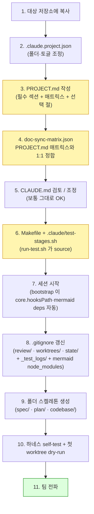

# Claude Code Harness (v2) — 가이드

> 본 저장소는 **Claude Code 하네스 템플릿** 입니다.
> SDD + TDD + AI Review 자동화 + 다중 PR 통합까지 한 세트로 묶여 있어,
> README 의 단계만 따라하면 어느 저장소에서도 활용할 수 있습니다.
>
> 하네스 전체 구조와 강점/약점은 [`OVERVIEW.md`](OVERVIEW.md)을 참고하세요.

> 주 목적은 규모 있는 프로젝트에서도 안정적이고 지속적인 개발이 가능하도록 하는 것입니다.
> 따라서 상당히 많은 가드가 추가되어 있으며, 토큰 소모량이 높습니다.
> 잘못된 구현의 반복보다 한번의 비용은 높지만 반복을 줄이는 것이 최종 비용이 더 낮다는 관점에서 작성되었습니다.

> **v1 대비 v2 의 차이**: clemvion 프로젝트 하네스의 *현재 상태* 를 증류한 버전입니다. v1 의 4-layer worktree 가드에 더해 **review/plan push·stop 가드, worktree 브랜치 자동 정규화, mermaid 린트, SessionStart 부트스트랩, 네이티브 `Workflow` tool 경로, 하네스 self-test 스위트(`.claude/tests/`), 변경-유형 매트릭스의 machine-readable SSOT(`.claude/config/doc-sync-matrix.json`), reviewer/checker/writer 토글** 이 추가되었습니다.

---

## 1. 무엇이 들어있나

```
./                                    # 하네스 저장소 루트 (본 repo 자체가 템플릿)
├── .claude/                          # 하네스 본체 (모두 그대로 복사)
│   ├── agents/                       # 31 sub-agents (14 reviewer + router + summary +
│   │                                 #                resolution-applier + 5 checker + checker summary +
│   │                                 #                4 analyzer + analyzer summary + conflict resolver +
│   │                                 #                spec-impl-coverage-auditor + user-guide-writer)
│   ├── commands/                     # /ai-review · /consistency-check · /merge-coordinate
│   ├── config/
│   │   └── doc-sync-matrix.json      #   변경 유형 → 갱신 위치 매핑의 machine-readable SSOT
│   │                                 #   (PROJECT.md 표의 짝. user-guide-sync-reviewer 가 소비, test 가 1:1 검증)
│   ├── docs/                         # 공유 SSOT 문서 (lazy load — 호출 시에만 Read)
│   │   ├── README.md                 #   docs 인덱스 + newcomer 읽는 순서
│   │   ├── worktree-policy.md        #   Worktree 정책 + Enforcement 상세 + 브랜치 정규화
│   │   ├── plan-lifecycle.md         #   plan/in-progress ↔ complete 라이프사이클
│   │   ├── subagent-call-contract.md #   모든 sub-agent 의 공통 호출 규약·STATUS·재시도
│   │   ├── test-wrapper.md           #   .claude/tools/run-test.sh 사용법
│   │   └── orchestrator-workflow-migration.md  # (설계 문서) 오케스트레이터 → Workflow tool 이행안
│   ├── hooks/                        # Claude Code event hooks (자동 실행)
│   │   ├── _lib/branch_guard.py      #   default-branch 판정 (모든 layer 공유)
│   │   ├── _lib/branch_naming.py     #   worktree-* → claude/* 정규화 판정
│   │   ├── _lib/review_guard.py      #   미리뷰 코드 변경 판정 (push/stop 가드 공유)
│   │   ├── _lib/plan_guard.py        #   plan 미갱신·완료-미이동 판정
│   │   ├── guard_default_branch_edit.py    # PreToolUse (Write/Edit/…) — 차단
│   │   ├── guard_default_branch_bash.py    # PreToolUse (Bash) — 세션당 1회 리마인더
│   │   ├── guard_default_branch_prompt.py  # UserPromptSubmit — 작업성 키워드 매칭 시 리마인더
│   │   ├── guard_review_before_push.py     # PreToolUse (Bash) — git push 차단 (review/plan 미충족)
│   │   ├── guard_review_before_stop.py     # Stop — turn 종료 전 review/plan nudge (세션당 1회)
│   │   ├── normalize_worktree_branch.py    # UserPromptSubmit + PreToolUse(Bash) — 브랜치명 자동 교정
│   │   ├── lint_mermaid_posttooluse.py     # PostToolUse (Write/Edit) — 편집된 md 의 mermaid 린트
│   │   ├── mark_resolution_in_flight.py    # PreToolUse (Agent) — resolution-applier 디스패치 마커
│   │   └── clear_resolution_in_flight.py   # SubagentStop — 마커 제거 (fix 중 Stop 재리뷰 nudge 억제)
│   ├── skills/                       # 6개 핵심 skill + _lib
│   │   ├── _lib/project_config.py    #   .claude.project.json 로더 (경로·토글)
│   │   ├── developer/                #   구현/TDD 워크플로
│   │   ├── project-planner/          #   기획/Spec 워크플로
│   │   ├── consistency-checker/      #   사전 일관성 검토 (5 checker 병렬)
│   │   ├── code-review-agents/       #   사후 코드 리뷰 (14 reviewer + router + summary + resolution-applier)
│   │   ├── merge-coordinator/        #   다중 PR 통합 (4 analyzer + summary + resolver)
│   │   └── spec-coverage/            #   spec-impl 갭 standing audit (수동 호출)
│   ├── tests/                        # 하네스 자체 Python self-test (표준 라이브러리만)
│   ├── tools/
│   │   ├── ensure-worktree.sh        #   canonical worktree 생성 헬퍼
│   │   ├── run-test.sh               #   TEST WORKFLOW stage 출력 truncation wrapper
│   │   ├── bootstrap-session.sh      #   SessionStart — core.hooksPath·mermaid deps·state GC·worktree reap
│   │   ├── cleanup-worktree.sh       #   단일 worktree 정리
│   │   ├── reap-merged-worktrees.sh  #   PR 머지된 worktree·branch 자동 회수 (local-only, fail-safe)
│   │   ├── plan-stale-audit.sh       #   stale in-progress plan 검출 (worktree 귀속 확인)
│   │   └── mermaid-lint/             #   mermaid 파서 (node — node_modules 는 bootstrap 이 설치)
│   ├── workflows/                    # 네이티브 Workflow tool 스크립트 (plan-metered)
│   │   ├── ai-review.js              #   route → review → summary
│   │   ├── consistency-check.js
│   │   └── merge-coordinate.js
│   ├── OPTIONAL_SKILLS.md            # 미설치 선택 skill 포인터 (예시)
│   ├── settings.json                 # hook 등록 (SessionStart/PreToolUse/PostToolUse/Stop/UserPromptSubmit) + statusLine
│   ├── statusline.sh                 # 터미널 상태줄 (선택)
│   ├── test-stages.sh.example        # 프로젝트가 cp 후 cmd_lint/unit/build/e2e 함수 채움
│   └── README.md                     # .claude/ 디렉토리 인덱스 + agent 레지스트리
├── .githooks/
│   └── pre-commit                    # commit 단계 default-branch 차단 + mermaid 린트
├── scripts/
│   └── setup-githooks.sh             # core.hooksPath 등록 (clone 후 1회 — bootstrap 이 자동 수행하므로 보조)
├── CLAUDE.md                         # 공통 규약 (상세는 .claude/docs/ 참고)
├── PROJECT.md                        # 프로젝트별 매핑 (채택 시 작성 필수 — placeholder template)
├── .claude.project.json              # 폴더 경로 매핑 + reviewer/checker/writer 토글
├── Makefile                          # setup-githooks 타겟 (프로젝트 타겟은 채택 시 추가)
├── OVERVIEW.md                       # 하네스 전체 구조 + 강점/약점 + 라이프사이클
└── README.md                         # 본 문서
```

### 제외된 항목 (의도적)

- `.claude/settings.local.json` — 사용자별 로컬 override (committed 하지 않음).
- `.claude/state/`, `.claude/worktrees/`, `.claude/review/` — 런타임 산출물 (gitignore).
- `.claude/test-stages.sh` — 프로젝트가 채택 시 `.example` 에서 cp 후 자기 명령으로 채움 (committed 함, 단 `.example` 만 본 템플릿에 포함).
- `.claude/tools/mermaid-lint/node_modules/` — `bootstrap-session.sh` 가 main checkout 에 1회 `npm install`.

---

## 2. 사전 요구사항 (Prerequisites)

| 항목 | 최소 버전 | 확인 명령 |
|------|-----------|-----------|
| git | 2.30+ (worktree 정상 동작) | `git --version` |
| python3 | 3.8+ (hooks · orchestrator · tests — 표준 라이브러리만) | `python3 --version` |
| node | mermaid 린트용 (선택 — 없으면 fail-open) | `node --version` |
| Claude Code CLI | 최신 | `claude --version` |
| bash | 4+ (또는 zsh) | `bash --version` |

> 본 하네스는 모든 model 호출을 **플랜 토큰에 포함되는 main session 경로**(`Agent` tool / `Workflow` tool) 로만 진행하므로 추가 SDK 설치 불필요 (`claude -p`, Anthropic SDK 직접 호출은 정책상 금지 — [`CLAUDE.md` §외부 LLM 호출 정책](CLAUDE.md)).

---

## 3. 초기 세팅



### 단계 1 — 대상 저장소에 복사

본 저장소가 곧 템플릿이다. `<harness-repo>` 는 본 저장소를 clone 한 로컬 경로.

```bash
cd <target-repo-root>

# (1) 하네스 본체
cp -R <harness-repo>/.claude          .
cp -R <harness-repo>/.githooks        .
cp -R <harness-repo>/scripts          .

# (2) 정책·매핑 문서
cp <harness-repo>/CLAUDE.md                .
cp <harness-repo>/PROJECT.md               .
cp <harness-repo>/.claude.project.json     .

# (3) Makefile — 기존 Makefile 이 있으면 setup-githooks 타겟만 추가 (단계 6)
cp <harness-repo>/Makefile             .   # 또는 통합
```

> **이미 git repo 라면** `git add` 전에 단계 2-8 까지 마치고 한 PR (`chore(harness): adopt Claude Code harness`) 로 묶어 올린다.

### 단계 2 — `.claude.project.json` (폴더 경로 + agent 토글)

폴더 배치가 하네스 기본값과 동일하면 경로 키는 생략 가능. 본 파일은 두 가지를 담는다:

- **경로 매핑** (`corpora.*`, `outputs.*`, `code_areas`) — 누락 시 모두 기본값.
- **agent 토글** (`agents.{reviewers,checkers,writers}`) — reviewer/checker/writer 를 부분 disable. 키를 지우거나 `false` 로. **SKELETON 디폴트**: `reviewers.user_guide_sync` 와 `writers.user_guide` 는 `false` 로 출고된다 — 둘 다 프로젝트별 in-repo 사용자 가이드 + i18n/docs 동반-갱신 매트릭스를 전제하므로, 그 셋업을 채택한 프로젝트만 `true` 로 켠다 (아래 "채택 시 도메인 커스터마이징" 참고).

| 키 | 기본값 | 의미 |
|----|--------|------|
| `corpora.spec` | `spec` | 제품 spec SSOT 루트 |
| `corpora.conventions` | `spec/conventions` | 정식 규약 폴더 |
| `corpora.plan_in_progress` | `plan/in-progress` | 진행 중 plan |
| `corpora.plan_complete` | `plan/complete` | 완료 plan |
| `outputs.review_code` | `review/code` | `/ai-review` 세션 디렉토리 부모 |
| `outputs.review_consistency` | `review/consistency` | `/consistency-check` 부모 |
| `outputs.review_merge` | `review/merge` | `/merge-coordinate` 부모 |
| `code_areas` | `["codebase"]` | 코드베이스 루트 (배열 — 멀티 가능) |

> **개념(concept) 자체는 변경 불가**. spec corpus / plan tracking / review outputs / code areas 라는 개념은 하네스 계약의 일부. 폴더 위치만 옮길 수 있다.

### 단계 3 — `PROJECT.md` 작성 (필수)

가장 비중이 큰 단계. **모든 placeholder (`<...>`) 를 실제 값으로 치환**. 직접 작성이 부담될 경우 맨 뒤로 미루고 `claude` 에게 요청해서 갱신할 수 있다 (특히 기존 프로젝트 도입 시 유용).

필수: 코드베이스 구조 · 빌드·린트·테스트 명령 · e2e 면제 화이트리스트 · 변경 유형 매핑 · e2e 작성 가이드 · 도메인 어휘. 방법론 절(e2e 실행 원칙 · 사후 보정 PR 패턴 금지)은 baked-in — 인프라명·실측 사례만 채운다. 선택 절(유저 가이드 컨벤션 · i18n dict 컨벤션 · 자동 가드 · 버전·도구 정책 · 보조 스크립트)은 프로젝트 사정에 따라 채택·삭제. 끝의 **작성 체크리스트** 를 모두 처리 후 안내 문구 삭제.

### 단계 4 — `doc-sync-matrix.json` 정합 (변경 유형 매핑이 있을 때)

`.claude/config/doc-sync-matrix.json` 은 PROJECT.md 의 "변경 유형 → 갱신 위치 매핑" 표의 **machine-readable 짝**이다. `user-guide-sync-reviewer` 가 이 JSON 을 SSOT 로 읽고, `.claude/tests/test_doc_sync_matrix.py` 가 **두 표현의 행 수 1:1 + 참조 경로 실존** 을 검증한다. 둘을 같은 PR 에서 갱신한다. 변경-유형 동반 갱신이 없는 프로젝트라면 rows 를 비우고 `user_guide_sync` reviewer 를 disable 한다.

### 단계 5 — `CLAUDE.md` 검토

공통 규약(worktree 정책 · skill 체계 · 외부 LLM 호출 금지 등)의 핵심 SSOT. **보통 그대로 사용**. 본 저장소만의 특수 사정이 있으면 "## 폴더 구조" 를 `code_areas` 와 일관성 맞추는 정도만 조정. `.claude/docs/` 하위 doc 들도 같이 복사된다 — 별도 조정 보통 불필요.

### 단계 6 — `Makefile` + `.claude/test-stages.sh`

`.claude/tools/run-test.sh` 가 source 하는 4개 함수를 채운다:

```bash
cp .claude/test-stages.sh.example .claude/test-stages.sh
$EDITOR .claude/test-stages.sh
```

```bash
cmd_lint()  { cd codebase/backend && npm run lint; }
cmd_unit()  { cd codebase/backend && npm test; }
cmd_build() { cd codebase/backend && npm run build; }
cmd_e2e()   { make e2e-test; }
```

PROJECT.md §빌드·린트·테스트 명령 표와 **1:1 일치** 해야 한다. 상세: [`.claude/docs/test-wrapper.md`](.claude/docs/test-wrapper.md).

### 단계 7 — git hook 활성화 (대부분 자동)

`.claude/tools/bootstrap-session.sh` 가 **SessionStart 마다** `core.hooksPath` 를 `.githooks` 로 자동 설정하고, mermaid-lint deps 를 main checkout 에 1회 설치하며, stale state 마커와 머지된 worktree 를 회수한다. 즉 새 세션을 한 번 열면 끝. 수동으로 하려면:

```bash
make setup-githooks
git config --get core.hooksPath   # → .githooks
```

> `core.hooksPath` 는 **per-clone 설정**. bootstrap 이 자동 처리하지만, CI 처럼 Claude Code 세션 밖에서 commit 한다면 `make setup-githooks` 를 한 번 돌려둔다.

### 단계 8 — `.gitignore` 갱신

```gitignore
.claude/worktrees/
.claude/state/
.claude/settings.local.json
.claude/tools/mermaid-lint/node_modules/
_test_logs/
review/**/_prompts/
```

> `review/code/`, `review/consistency/`, `review/merge/` 의 SUMMARY/RESOLUTION 등 결론 산출물은 기본 **commit 대상** (감사 흔적). `_prompts/` 만 제외.

### 단계 9 — 폴더 스켈레톤 생성

```bash
mkdir -p spec/conventions plan/in-progress plan/complete
mkdir -p review/code review/consistency review/merge
mkdir -p codebase  # 또는 .claude.project.json 의 code_areas
```

### 단계 10 — 하네스 self-test + 첫 worktree dry-run

```bash
# (a) 하네스 Python self-test (코드 없이도 대부분 통과 — 아래 주의 참고)
python3 -m unittest discover -s .claude/tests -p 'test_*.py'

# (b) worktree 신설
.claude/tools/ensure-worktree.sh harness-smoke-test
cd .claude/worktrees/harness-smoke-test-*

# (c) main 워크트리에서 Write/Edit 시도 → 차단되는지 확인
# (d) /ai-review (변경 없으면 minimal SUMMARY 종료)
# (e) .claude/tools/run-test.sh lint  → PASS 시 한 줄, _test_logs/ 에 로그 보존
```

확인 포인트:
- [ ] main 워크트리에서 Write/Edit 호출이 차단됨 (`guard_default_branch_edit.py`)
- [ ] `git commit` (main 워크트리) 차단됨 (`.githooks/pre-commit`)
- [ ] 미리뷰 코드 변경 상태에서 `git push` 가 차단됨 (`guard_review_before_push.py`)
- [ ] `worktree-*` 브랜치가 `claude/*` 로 자동 정규화됨
- [ ] `/ai-review` 가 `review/code/<YYYY>/…/` 디렉토리 생성

> **self-test 주의**: 대부분의 테스트(branch_guard, review_guard, plan_guard, branch_naming, agent_consistency, orchestrator_state 등)는 git/fs 를 patch 한 hermetic 테스트라 빈 스켈레톤에서도 통과한다. **단 `test_doc_sync_matrix.py`** 는 `codebase/` · `spec/` 의 실제 파일(`*.test.ts`, `spec/...md`)을 검사하는 harness↔product 바인딩이라, 코드가 아직 없는 빈 스켈레톤에서는 일부 sub-test 가 실패한다 — adoption 후 활성화되는 것이 정상이다.

### 단계 11 — 팀 전파

- README + CLAUDE.md + PROJECT.md + `.claude/docs/` 를 PR 로 올림.
- 채택 후 첫 주는 페어로 작업 — 새 패턴(worktree, push/stop 가드, `/ai-review` 자동 흐름)에 익숙해질 때까지.
- 공유 자료: [`OVERVIEW.md`](OVERVIEW.md).

### 채택 시 도메인 커스터마이징 필요 지점 (skeleton 잔여)

본 스켈레톤은 generic 머신러리만 담지만, 몇몇 **선택 기능은 도메인 예시를 담은 채** 출고되어 채택 시 자기 프로젝트에 맞춰야 한다 (그래서 디폴트 off 거나 수동 호출). 끄거나 채울 지점:

| 기능 | 상태 | 채택 시 할 일 |
|---|---|---|
| `user_guide_sync` reviewer + `user_guide` writer | `.claude.project.json` 에서 **디폴트 false** | in-repo 사용자 가이드 + i18n/docs 동반-갱신 매트릭스를 쓰는 프로젝트만 `true`. 켜기 전 `.claude/agents/user-guide-{sync-reviewer,writer}.md` 와 `code-review-agents/lib/role_instructions.py` 의 `user_guide_sync` 항목이 담은 예시 경로(i18n dict·docs MDX·에러코드 매핑)를 자기 구조로 교체. SoT 는 `PROJECT.md §유저 가이드 컨벤션` + `doc-sync-matrix.json` |
| `/spec-coverage` (`spec-impl-coverage-auditor`) | **수동 호출 전용**, CI 차단 아님 | `spec_coverage_orchestrator.py` / `spec-impl-coverage-auditor.md` 의 spec-영역 INCLUDE/EXCLUDE 목록은 예시 레이아웃(`spec/2-navigation` 등)이므로 자기 `spec/` 영역으로 교체. SoT 는 프로젝트가 채택하는 `spec/conventions/spec-impl-evidence.md` 규약 |
| `doc-sync-matrix.json` rows | placeholder 8행 | `PROJECT.md` §변경 유형 매핑과 1:1 로 자기 변경유형으로 교체 (§단계 4) |

> 이들은 v1 스켈레톤이 잡은 것과 동일한 잔여다 (v1 도 user_guide 토글을 off 로 출고). 일반 리뷰·일관성·통합 흐름(13 reviewer + 5 checker + merge)은 도메인 가정 없이 그대로 동작한다.

---

## 4. 일상 사용 흐름 (유저 패턴 예시)

> 이 하네스는 "이 버그 고쳐줘" · "X API 추가해줘" 같은 **직접 task 지시형**이 아닙니다. 기획 → 개발 → QA 에 이르는 **전체 개발 파이프라인**을 담고 있고, 대화하는 유저는 **고객(클라이언트)** 의 컨셉에 가깝습니다.

고객은 원하는 것을 **모호하게** 알고 있을 뿐, 정확한 그림을 들고 오지 않습니다. 어시스턴트와 대화하며 점점 구체화하고, 만족할 만큼 구체화되어 **고객이 spec 을 승인하면, 그 이후는 어시스턴트가 끝까지 책임지고 완주**합니다. **spec 승인이 "함께 다듬기 → 위임" 의 분기점**입니다.

### 전형적인 대화 흐름 (예: 주문 프로세스에 쿠폰 기능 추가)

1. **모호한 요구 제기**
   > "주문 프로세스에 쿠폰 기능을 추가하고 싶어. 주로 사용되는 방식과 추천하는 방안을 제안해줘."

   어시스턴트는 가능한 방식·권장안·근거를 정리해 제시하고, 목적·제약을 되물으며 요구사항을 구체화합니다. *(아직 코드도 spec 도 건드리지 않습니다.)*

2. **여러 턴의 대화로 방향성 합의** — 정률/정액·중복 사용·만료·재고 연동 같은 결정을 주고받으며 윤곽이 잡힙니다.

3. **spec 초안 작성** — 유저가 *"이 방향으로 spec 작성해줘"* 라고 하거나, 어시스턴트가 *"이 정도면 spec 초안을 써도 될까요?"* 라고 제안 → `project-planner` 가 `spec/` 에 초안 작성.

4. **검토 · 승인** — 어시스턴트가 *"검토하시고, 이대로 진행할지 / 바꿀 점이 있는지 알려주세요"* 라고 묻고, 추가 대화로 spec 을 다듬습니다.

5. **plan 생성 · 구현 착수** — spec 이 승인되면 plan 을 만들고 구현에 들어갑니다. 이때부터 worktree·TDD·TEST·리뷰는 **유저가 신경 쓰지 않아도** 하네스가 자동으로 굴립니다 (→ §5).

6. **(선택) 백로그 운영** — plan 에 티켓이 쌓이면 유저가 특정 티켓을 지정하거나, *"다음에 처리할 티켓을 추천해줘"* 라고 맡깁니다.

### 핵심 — 직접 지시가 아니라 위임

- 유저는 worktree·`--impl-prep`·TDD 같은 **내부 단계 이름을 외울 필요가 없습니다** — 그건 §5 의 일이고, 잊으면 hook 이 안내·차단합니다.
- 유저가 의식적으로 하는 것은 ① 원하는 바를(모호해도) 말하기 ② 질문에 답하며 구체화 ③ **spec 승인** ④ 결과(PR) 검토 정도입니다.
- 방향이 이미 명확하면 *"바로 spec 작성해줘"* 로 건너뛰거나, 단순 질의(*"이 함수 어떻게 동작해?"*)는 worktree 없이 바로 답변받을 수도 있습니다.

---

## 5. 내부 동작 흐름 (한 장 요약)

claude code 에 작업을 요청하면, 내부적으로 아래의 흐름으로 동작합니다.

```bash
# 1. 작업 시작 — 항상 worktree (canonical 헬퍼)
.claude/tools/ensure-worktree.sh <task_name>
cd .claude/worktrees/<task_name>-<slug>

# 2. Spec 변경이 필요하면 → project-planner skill
#    spec/ 쓰기 직전 /consistency-check --spec 자동 호출

# 3. 구현 → developer skill
#    구현 착수 직전 /consistency-check --impl-prep 자동
#    TDD: 테스트 선작성 → 구현 → 보강
#    TEST WORKFLOW: lint → unit → build → e2e (각 단계 .claude/tools/run-test.sh <stage>)

# 4. 사후 리뷰 (구현 완료 시 강제 — push/stop 가드가 미루기 차단)
/ai-review                                 # 14 reviewer 병렬 (router 선별), summary, resolution-applier 자동 후속

# 5. 한도 걸리면 무한 재시도
/loop /ai-review                           # ScheduleWakeup 으로 자동 재시도

# 6. PR 생성 (사용자가 명시 요청 시만) — push 전 review·plan 가드 통과 필요
gh pr create ...

# 7. 다중 PR 통합
/merge-coordinate <PR#> <PR#>

# 8. worktree 정리 (PR 머지되면 bootstrap 의 reaper 가 자동 회수도 함)
git worktree remove .claude/worktrees/<task>-<slug>
```

---

## 6. Troubleshooting

### "BLOCKED by guard_default_branch_edit.py"
main 워크트리(default branch)에서 Write/Edit 시도. `.claude/worktrees/<task>-<slug>/` 에서 작업하거나, 정당한 이유면 `BYPASS_DEFAULT_BRANCH_GUARD=1`.

### "BLOCKED by guard_review_before_push.py" (review gate / plan gate)
branch 에 `codebase/**` 변경이 있는데 *해결된* 코드 리뷰가 없거나(`/ai-review` 미수행 또는 Critical/Warning 미해결), 연결된 in-progress plan 이 갱신·이동되지 않음. `/ai-review` 수행 + RESOLUTION 작성 후 다시 push, 또는 plan 갱신/이동. 오판이면 `BYPASS_REVIEW_GUARD=1` / `BYPASS_PLAN_GUARD=1`.

### Stop hook 이 turn 종료를 막음
`guard_review_before_stop.py` 의 review/plan nudge (세션·branch 당 1회). 안내대로 REVIEW WORKFLOW 이행 또는 plan 이동. 정말 지금 멈춰야 하면 사용자에게 사정 보고.

### `make setup-githooks` 안 했는데 commit 이 차단되지 않음 / 됨
보통 `bootstrap-session.sh` 가 SessionStart 에 자동 설정. `git config --get core.hooksPath` → `.githooks` 확인. `.githooks/pre-commit` 실행권한(`chmod +x`) 확인.

### `/ai-review` 실행 시 "module not found"
`.claude/skills/_lib/` 가 복사됐는지 확인. orchestrator 들이 `_lib.session`, `_lib.project_config` 를 import. `ls .claude/skills/_lib/project_config.py`.

### `consistency-check` 가 spec 영역을 못 찾음
`.claude.project.json` 의 `corpora.spec` 와 실제 폴더 불일치. 보통 JSON 값을 실제 폴더에 맞춤.

### `.claude/tools/run-test.sh` 가 "CONFIG_MISSING"
`.claude/test-stages.sh` 부재. `cp .claude/test-stages.sh.example .claude/test-stages.sh` 후 4개 함수 채움.

### mermaid 린트가 안 돎 / commit 이 mermaid 로 막힘
`node` 미설치면 fail-open(통과). deps 미설치면 `bootstrap-session.sh` 가 다음 세션에 설치, 또는 `cd .claude/tools/mermaid-lint && npm install`. 막혔으면 해당 ```mermaid 블록 문법을 고치고 re-stage.

### sub-agent 가 즉시 `STATUS=fatal`
`.claude/agents/<name>.md` 부재, prompt 파일 부재, 또는 `output_file` 쓰기 권한 없음. `review/<…>/_prompts/<name>.md` 생성 여부 확인.

### Sub-agent 들이 모두 rate_limit
1시간/5시간 한도 도달. `/loop /ai-review` 로 진입하면 `ScheduleWakeup` 이 한도 회복 시점에 자동 재시도. main session 점유 안 함.

### `test_doc_sync_matrix.py` 가 빈 스켈레톤에서 실패
정상. 이 테스트는 `codebase/`·`spec/` 의 실제 파일을 검사하는 harness↔product 바인딩이라 코드 채택 후 활성화된다 (§3 단계 10 주의 참고).

---

## 7. 다음 단계 — 깊이 있는 학습

| 주제 | 문서 |
|------|------|
| 하네스 전체 구조 / 강점·약점 | [`OVERVIEW.md`](OVERVIEW.md) |
| 공통 규약 (짧은 SSOT) | `CLAUDE.md` |
| `.claude/` 디렉토리 인덱스 + agent 레지스트리 | `.claude/README.md` |
| docs 인덱스 + 읽는 순서 | `.claude/docs/README.md` |
| Worktree 정책 + 브랜치 정규화 | `.claude/docs/worktree-policy.md` |
| Plan 라이프사이클 | `.claude/docs/plan-lifecycle.md` |
| Sub-agent 호출 규약 (공통) | `.claude/docs/subagent-call-contract.md` |
| Test wrapper 사용법 | `.claude/docs/test-wrapper.md` |
| Orchestrator → Workflow 이행안 (설계) | `.claude/docs/orchestrator-workflow-migration.md` |
| 역할별 워크플로 | `.claude/skills/<role>/SKILL.md` |
| Sub-agent 정의 (31종) | `.claude/agents/*.md` |
| 하네스 self-test | `.claude/tests/README.md` |

---

## 8. 라이선스 · 기여

본 하네스는 Clemvion 프로젝트에서 추출한 generic skeleton 입니다.<br/>
MIT 라이센스이며, 자유롭게 수정 및 재배포가 가능합니다.<br/>
개선을 위한 아이디어가 있다면 PR 부탁드립니다.
